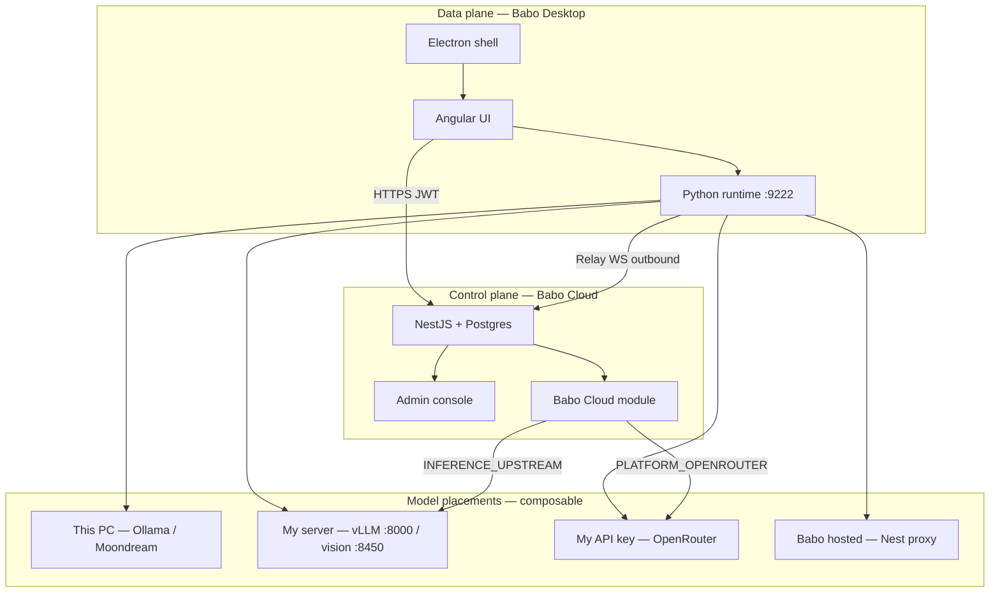
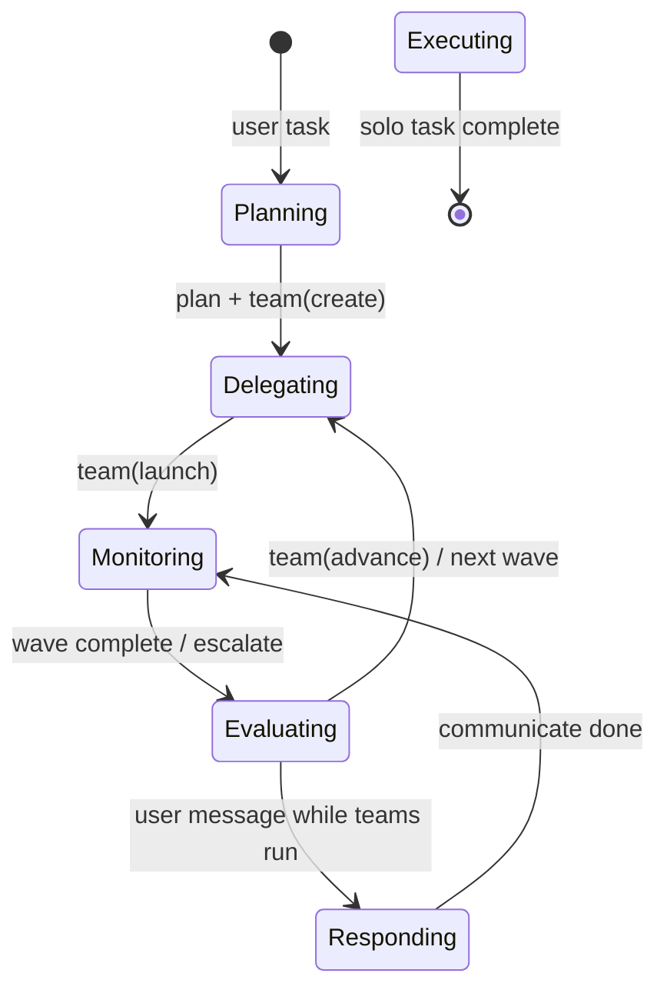

# 2026 release: Babo Cloud + orchestration architecture

**Branch:** `feature/babo-cloud-inference-proxy` · **Baseline:** `main` (May 2026)

This page is the **architecture delta** for the largest change set since the initial Babo docs. It explains what shipped on the feature branch, how the pieces connect, and where to read deeper.

---

## Executive summary

| Area | On `main` | On this branch |
|------|-----------|----------------|
| **Inference** | BYOK / local vLLM only | **Babo Cloud** relay (OpenRouter resold + GX10 upstream), per-agent model binding |
| **Control plane** | NestJS auth + relay | + **Admin console**, usage ledger, subscriptions stub, 8MB inference body limit |
| **Agentic loop** | Plans + basic delegates | **Team waves**, orchestrator modes, coordinator policy, stall/skill recovery |
| **Memory** | Cryptex rings (static order) | **Dynamic ring priorities** by cognitive phase; SubCryptex for delegates |
| **Desktop onboarding** | Basic setup | **Capability profiles** (4 workloads × 5 placements), LAN scan, day-1 coach |
| **Frontend** | Single chat socket | **Multi-agent WebSocket**, run panel, model picker, theme system, workspace IDE |
| **Tests** | Core unit tests | +30 orchestration / plan / stall / policy tests |

Approximate diff vs `main`: **455 files**, **+62k / −11k** lines (including frontend theme migration and agentic subsystem).

---

## System diagram (production)

**Read next:** [Production architecture & onboarding](production-architecture-and-onboarding.md) · [Babo Cloud personas](babo-cloud-personas-and-commercial-design.md) · [Capability profiles](capability-profiles-and-onboarding.md)

---

## Babo Cloud (control plane)

NestJS module `backend/src/babo-cloud/` exposes OpenAI-compatible inference and GPU worker proxies when `BABO_CLOUD_MODE=true`.

| Surface | Purpose |
|---------|---------|
| `POST /api/inference/v1/chat/completions` | Chat + tools (upstream: GX10 vLLM or OpenRouter) |
| `POST /api/gpu/transcribe` | Voice input proxy |
| `POST /api/gpu/vision/describe` | Ambient vision proxy |
| `GET /api/cloud/subscription` | Plan + token allowance |
| `GET /api/cloud/usage` | Metering ledger |

Desktop maps **hosted_babo** placements to `{nestjs}/api/inference/v1`.

**Deploy:** [Babo Cloud Railway ↔ GX10](../configuration/babo-cloud-railway-gx10.md) · **Module ref:** [NestJS Babo Cloud](nestjs-modules/babo-cloud.md)

---

## Orchestration architecture (data plane)

The agentic subsystem grew from “plan + delegate” into a **coordinator / worker** model:

| Concept | Module | Role |
|---------|--------|------|
| **Orchestrator** | `loop.py` + `types.py` | Owns plan, Kanban, team lifecycle; restricted IC tools while wave runs |
| **Team waves** | `team_manager.py`, `wave_coordination.py` | Batch delegates per plan step; auto-advance, completion review |
| **Orchestration policy** | `orchestration_policy.py` | Tool allowlists per mode, wake messages, escalation handling |
| **Coordinator guard** | `coordinator_guard.py` | Blocks orchestrator from doing delegate work |
| **SubCryptex** | `sub_cryptex.py` | Per-delegate memory rings + ring priority boost on hint/stall |
| **Skill discovery boost** | `skill_discovery_boost.py` | Promotes skills/tools rings when stuck |

**Deep dive:** [Orchestration & delegation](orchestration-and-delegation.md) · [Skill discovery & recovery](skill-discovery-and-recovery.md)

---

## Per-agent model selection

Each agent can bind a **session default model** (orchestrator brain) separately from **delegate model** (sub-agent workers).

| Layer | Storage | UI |
|-------|---------|-----|
| NestJS | `Agent.sessionModel`, inference hierarchy | Chat model picker |
| Python runtime | Persisted via relay PATCH | Used by `generator.py` / side paths |

Cloud agents route through Babo Cloud with the selected OpenRouter or upstream model id.

---

## Frontend architecture changes

| Feature | Location | Notes |
|---------|----------|-------|
| Multi-agent WebSocket | `websocket.service.ts` | One socket per agent; parallel test runs |
| Run panel | `features/chat/run-panel/` | Live tool/orchestration timeline |
| Model picker | `features/chat/chat-model-picker/` | Session + advanced delegate override |
| Theme system | `theme.service.ts`, `_theme.scss` | Light/dark glass; agent card contrast fixes |
| Workspace IDE | `features/projects/workspace/` | CodeMirror explorer (replaces legacy IDE panel) |
| Capability settings | `capability-settings-panel/` | Four workloads, placement cards |
| Day-1 coach | `shared/onboarding/day1-coach` | Post-setup guidance |

**Read:** [Frontend application](frontend-application.md) (updated)

---

## Memory & compaction

| Change | Detail |
|--------|--------|
| **Ring priorities** | `CryptexMemory.update_ring_priorities()` — phase/mode reorders rings in the prompt |
| **Stuck profile** | On stall/hint, skills + tools rings jump to top (`skill_discovery_boost`) |
| **Anchored compaction** | Large `read` / `web_fetch` / `semantic_search` digested before history bloat |
| **Compaction hook** | `on_compaction` → Cryptex absorbs anchor summaries |
| **SubCryptex** | Delegates inherit relevant parent skills; own progress/knowledge rings |

**Read:** [Brain & memory](brain-and-memory.md) (updated)

---

## Documentation map (new & updated)

| Document | Topic |
|----------|-------|
| [Production architecture & onboarding](production-architecture-and-onboarding.md) | Ship-ready stack + wizard UX |
| [Capability profiles & onboarding](capability-profiles-and-onboarding.md) | Four workloads, placements, vision strategy |
| [Babo Cloud personas & commercial design](babo-cloud-personas-and-commercial-design.md) | Billing, BYOK, personas |
| [Vision worker](vision-worker.md) | Moondream / LAN / hosted ambient eyes |
| [Orchestration & delegation](orchestration-and-delegation.md) | Teams, waves, policy |
| [Skill discovery & recovery](skill-discovery-and-recovery.md) | Stall, ClawHub, recipes, gh auth |
| [Babo Cloud module](nestjs-modules/babo-cloud.md) | Nest routes & env |
| [Railway ↔ GX10](../configuration/babo-cloud-railway-gx10.md) | Deploy wiring |

---

## GitHub Pages

Documentation builds with **MkDocs Material** (`mkdocs.yml`). The site root at [umbecanessa.github.io/babo](https://umbecanessa.github.io/babo/) overlays the marketing homepage from `website/`.

- **Deploy trigger:** push to `main` (or this feature branch while active) with changes under `docs/`, `mkdocs.yml`, or `website/`
- **Local preview:** `pip install -r requirements-docs.txt && mkdocs serve`

After merging this branch to `main`, the workflow in `.github/workflows/docs.yml` publishes the updated architecture automatically.

---

## Migration notes (main → this branch)

1. **Railway:** set `BABO_CLOUD_MODE`, inference/GPU upstream URLs — see [config doc](../configuration/babo-cloud-railway-gx10.md).
2. **Desktop:** re-run setup wizard or import capability profile JSON.
3. **Agents:** existing agents keep DomainDB; session model defaults to genesis template unless user picks a model.
4. **Parallel agents:** each agent needs its own WebSocket connection (handled automatically in UI).
