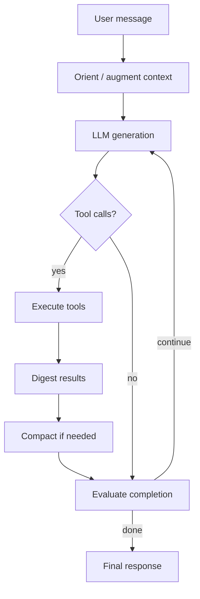

# Agentic loop

Multi-step autonomy: the agent calls tools, evaluates progress, and continues until done or limits hit.

**Core:** `nls/agentic/loop.py` → `async def run_loop(...)`

---

## Control flow

---

## Key modules

| Module | File | Responsibility |
|--------|------|----------------|
| Loop | `loop.py` | Orchestration, iteration limits, mode switching |
| Generator | `generator.py` | LLM calls, streaming |
| Executor | `executor.py` | Parallel/sequential tool runs, delegates |
| Compactor | `compactor.py` | Context compression with anchors |
| Evaluator | `evaluator.py` | `should_complete`, acceptance checks |
| Goals | `goals.py` | Extract/update goals from turns |
| Orchestrator | `orchestrator.py` | Sub-agent teams, waves |
| Team manager | `team_manager.py` | Delegate lifecycle |
| Plan store | `plan_store.py` | Plan persistence |
| Bridge | `bridge.py` | `LoopConfig`, `LoopHooks` builders |
| Types | `types.py` | Modes, allowlists, configs |
| Orchestration policy | `orchestration_policy.py` | Tool allowlists, wakes, coordinator phases |
| Tool mode policy | `tool_mode_policy.py` | Mode transitions after tool success |
| Coordinator guard | `coordinator_guard.py` | Blocks orchestrator IC work during waves |
| Skill discovery boost | `skill_discovery_boost.py` | Promotes skills ring on stall/hint |
| Recipe hints | `recipe_hints.py` | GitHub/recipe preflight injection |
| Wave coordination | `wave_coordination.py` | Tech stack + file ownership for delegates |

---

## Agent modes

Modes (`nls/agentic/types.py`) gate which tools and prompts apply:

| Mode | Typical use |
|------|-------------|
| Chat | Conversational |
| Planning | Plan tool heavy |
| Executing | Implementation |
| Delegating | Spawn sub-agents |
| Monitoring | Watch delegate progress |
| Evaluating | Completion / acceptance checks |

Mode transitions are driven by evaluator + orchestrator state + **tool_mode_policy** (e.g. `team(launch)` → MONITORING).

See [Orchestration & delegation](orchestration-and-delegation.md) for the full coordinator/worker model.

---

## Plans & teams

**Plan tool** (`nls/tools/agent_tools/plan.py`):

- Creates structured steps, sub-plans, acceptance criteria, `project_dir`, `tech_stack`
- Linked to Kanban via todo-list skill

**Team tool** (`team.py`) + **TeamManager** + **wave_coordination**:

- Orchestrator creates **waves** of delegates bound to plan steps
- Each delegate runs nested `run_loop()` with **SubCryptex** memory
- Progress streamed to Projects UI and **run panel**
- Orchestrator uses `team(hint/intervene/advance)` — not raw IC tools while wave runs

---

## Stall & skill recovery

When the agent repeats failing tools or ignores skills:

1. **Soft errors** — bash/gh exit-0 auth failures count as errors (`tool_result_semantics.py`)
2. **Stall nudges** — `detect_stall()` injects pivot messages (ClawHub, discover_tools)
3. **ERROR_RECOVERY** — system directive after consecutive failures
4. **Ring boost** — Cryptex skills/tools rings move to top of WM (`skill_discovery_boost.py`)

See [Skill discovery & recovery](skill-discovery-and-recovery.md).

---

## Context compaction

When token pressure is high, `compactor.py`:

- Preserves anchors (goals, constraints, plan id)
- **Anchors** large `read` / `web_fetch` / `semantic_search` via cognitive digest (≥4K chars)
- Summarizes older turns; `on_compaction` hook feeds Cryptex
- Default `relay_compact_message_chars`: 32K (no lossy bash truncation)

---

## Entry points (all call `run_loop`)

| Caller | Path |
|--------|------|
| User chat WS | `AgentRuntime.process_message_agentic_async` |
| OpenAI API | `routes/completions.py` |
| Sub-agent | `orchestrator.py` |
| Skill onboarding | `routes/skills.py` |
| Inner loop dispatch | `inner_loop.py` → autonomous messages |

---

## Configuration knobs

`LoopConfig` (via bridge) includes:

- `max_iterations`, `max_parallel_tools`
- Tool allow/deny lists per mode
- Streaming hooks for UI events

Hooks emit WS events: thoughts, tool_start/end, plan updates.

---

## Extension

See [Add an agent tool](../extension/add-agent-tool.md) to expose new capabilities to the loop.

---

## Related

- [User guide: Agentic loop & plans](../guides/agentic-loop-and-plans.md)
- [Orchestration & delegation](orchestration-and-delegation.md)
- [Skill discovery & recovery](skill-discovery-and-recovery.md)
- [2026 release architecture](2026-cloud-orchestration-release.md)
- [Agent runtime](agent-runtime.md)
