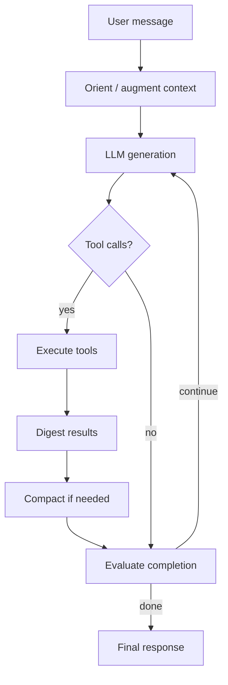

# Agentic loop

Multi-step autonomy: the agent calls tools, evaluates progress, and continues until done or limits hit.

**Core:** `nls/agentic/loop.py` → `async def run_loop(...)`

---

## Control flow

---

## Key modules

| Module | File | Responsibility |
|--------|------|----------------|
| Loop | `loop.py` | Orchestration, iteration limits, mode switching |
| Generator | `generator.py` | LLM calls, streaming |
| Executor | `executor.py` | Parallel/sequential tool runs, delegates |
| Compactor | `compactor.py` | Context compression with anchors |
| Evaluator | `evaluator.py` | `should_complete_v4`, acceptance checks |
| Goals | `goals.py` | Extract/update goals from turns |
| Orchestrator | `orchestrator.py` | Sub-agent teams, waves |
| Team manager | `team_manager.py` | Delegate lifecycle |
| Plan store | `plan_store.py` | Plan persistence |
| Bridge | `bridge.py` | `LoopConfig`, `LoopHooks` builders |
| Types | `types.py` | Modes, allowlists, configs |

---

## Agent modes

Modes (`nls/agentic/types.py`) gate which tools and prompts apply:

| Mode | Typical use |
|------|-------------|
| Chat | Conversational |
| Planning | Plan tool heavy |
| Executing | Implementation |
| Delegating | Spawn sub-agents |
| Monitoring | Watch delegate progress |
| Evaluating | Completion / acceptance checks |

Mode transitions are driven by evaluator + orchestrator state.

---

## Plans & teams

**Plan tool** (`nls/tools/agent_tools/plan.py`):

- Creates structured steps, sub-plans, acceptance criteria
- Linked to Kanban via todo-list skill

**Team tool** (`team.py`) + **delegate_ring**:

- Orchestrator spawns delegates with isolated context
- Each delegate runs nested `run_loop()` with scoped tools
- Progress streamed to Projects UI

---

## Context compaction

When token pressure is high, `compactor.py`:

- Preserves anchors (goals, constraints, plan id)
- Summarizes older tool results
- Keeps recent turns verbatim

---

## Entry points (all call `run_loop`)

| Caller | Path |
|--------|------|
| User chat WS | `AgentRuntime.process_message_agentic_async` |
| OpenAI API | `routes/completions.py` |
| Sub-agent | `orchestrator.py` |
| Skill onboarding | `routes/skills.py` |
| Inner loop dispatch | `inner_loop.py` → autonomous messages |

---

## Configuration knobs

`LoopConfig` (via bridge) includes:

- `max_iterations`, `max_parallel_tools`
- Tool allow/deny lists per mode
- Streaming hooks for UI events

Hooks emit WS events: thoughts, tool_start/end, plan updates.

---

## Extension

See [Add an agent tool](../extension/add-agent-tool.md) to expose new capabilities to the loop.

---

## Related

- [User guide: Agentic loop & plans](../guides/agentic-loop-and-plans.md)
- [Agent runtime](agent-runtime.md)
- [Projects & teams](../guides/projects-and-teams.md)
