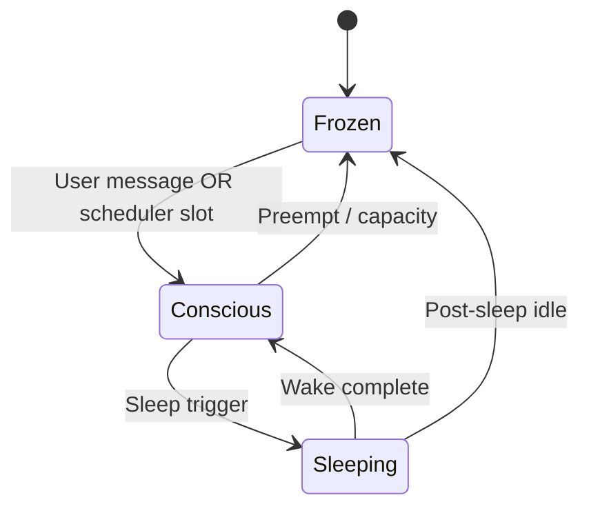

# Consciousness scheduler

The **ConsciousnessScheduler** decides which agents are actively "awake," sleeping, or frozen on disk when running multiple agents on one runtime.

**Source:** `server/services/consciousness_scheduler.py`

---

## States

| State | Meaning | Compute |
|-------|---------|---------|
| **CONSCIOUS** | Inner loop active — drives, heartbeat, daydream eligible | Active |
| **SLEEPING** | Consolidation cycle running | Active (sleep pipeline) |
| **FROZEN** | Persisted to disk, unloaded from hot path | Minimal |

---

## User preemption

**User messages always win** over background daydreaming.

| Surface | Mechanism |
|---------|-----------|
| **Web chat** | `on_user_message()` — pauses inner loop until the turn completes |
| **Channels** (DM, @mention, policy-triggered reply) | `preempt_background()` — cancels active dream; dispatches reply via inner-loop event queue |

If you message an agent that is **frozen**, the scheduler wakes it. You should not wait behind DMN dreams for a direct @mention on Telegram or a Home chat message.

**Cross-surface:** when Home is mid-turn, inbound Telegram/Discord traffic goes to the [surface inbox](channels-and-webhooks.md#cross-surface-defer) instead of starting a second deep loop.

Ambient group chatter (no reply) does **not** preempt background work.

---

## Priority when granting consciousness

When a dream/inner-loop slot frees up, frozen agents are ranked by:

| Factor | Weight | Meaning |
|--------|--------|---------|
| Time since last conscious | 40% | Fairness — don't starve idle agents |
| Drive pressure | 30% | Unmet curiosity, social, etc. |
| Signal buffer depth | 20% | Pending learning to process |
| Cortisol flag | 10% | Stress / error pressure |

Highest score gets the slot.

---

## Interaction with sleep scheduler

- **Sleep scheduler** (`sleep_scheduler.py`) — FIFO queue for consolidation jobs
- **Consciousness scheduler** — who may run inner loop vs stay frozen

An agent can be CONSCIOUS for chat while another SLEEPING on the same machine — subject to resource limits.

Sleep transitions are triggered by ANS/hormonal thresholds or `/sleep`, not arbitrarily by the consciousness scheduler alone.

---

## Daydream integration

When **CONSCIOUS** but no user session:

- [Inner loop](inner-loop.md) runs DMN on breath ticks (passive or active dreams)
- Uses inference API with lower priority than user chat
- Generates LEARN/REFLECT signals for later consolidation

---

## Capacity limits

`max_conscious` caps concurrent inner loops to protect CPU/memory. Additional agents stay **FROZEN** until a slot opens or user messages them.

Desktop installs typically run 1–3 agents; self-hosted servers may tune limits via runtime config.

---

## Related

- [Agent lifecycle](lifecycle.md)
- [Server runtime](server.md)
- [Brain dashboard](../guides/brain-dashboard.md)
- [Sleep & consolidation](../guides/sleep-and-consolidation.md)
