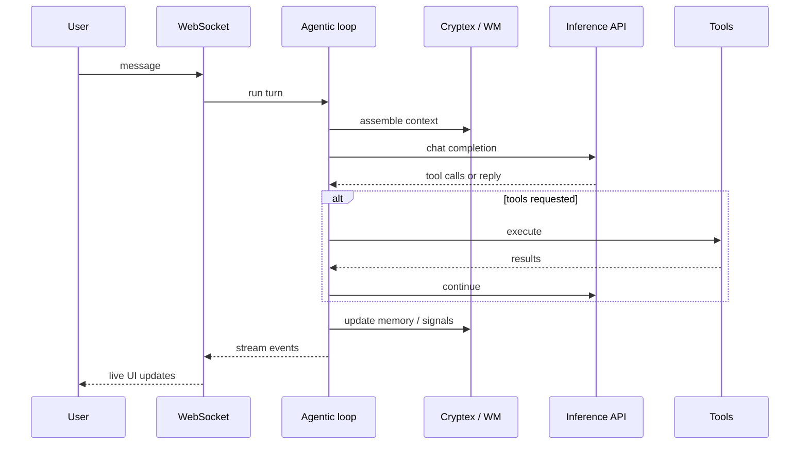

# Data flow

How information moves through Babo during chat, tool use, sleep, and idle time.

---

## Single chat turn

```text
User message
    │
    ▼
WebSocket handler (server/routes/chat/)
    │
    ▼
Agent runtime load ── Cryptex rings + working memory + history + tools
    │
    ▼
Agentic loop (nls/agentic/loop.py)
    ├─ Orient / augment context
    ├─ LLM call (OpenAI-compatible inference API)
    ├─ Execute tools (parallel when safe)
    ├─ Digest tool output
    ├─ Evaluate completion / plan progress
    └─ Stream events → frontend
    │
    ▼
Post-turn processing
    ├─ Signal extraction (LEARN, EVALUATE, REFLECT, …)
    ├─ Hormone updates (hypothalamus)
    ├─ Working memory slot updates
    ├─ DomainDB fact writes
    └─ Merkle chain block registration (when applicable)
    │
    ▼
Sleep scheduler check ── queue consolidation if thresholds met
```

### What the user sees

| Stage | UI |
|-------|-----|
| LLM thinking | Streaming text, optional thought events |
| Tool call | Tool started / completed cards |
| Learning | Signal sidebar badges |
| Completion | Turn completed event |

---

## Agentic loop detail



**Modes** (CHAT, PLANNING, DELEGATING, EXECUTING, …) filter which tools are primary so the agent stays focused.

**Compaction** runs when context nears token limits — anchored summarization preserves plans and system instructions.

---

## Plan and team flow

When work is plan-driven:

```text
User request
    → plan tool creates steps
    → todo-list skill syncs Kanban cards
    → delegatable steps → team tool spawns sub-agents
    → each delegate: isolated SubCryptex + tool subset
    → parent monitors via team_manager + Projects UI
    → completion updates plan + board + timeline
```

Team state persists in `data/agents/{id}/teams/`.

---

## Channel message flow

Inbound WhatsApp / Telegram / email:

```text
External message
    → skill webhook (server route)
    → normalized channel event
    → same agentic loop entry as chat
    → outbound reply via skill adapter (Baileys, Telegram API, Resend, …)
```

Channel policy (open / allowlist / disabled) enforced before the loop runs.

---

## Sleep consolidation pipeline

```text
Trigger (schedule / signal pressure / /sleep)
    │
    ▼
ANS: AWAKE → DROWSY → SLEEPING
    │
    ▼
Phase 1 — Triage
    Sort signals by priority (corrections > new learning)
    │
    ▼
Phase 2 — Consolidation (consolidation_sleep.py)
    LLM summarize learning buffer
    Route facts to Cryptex rings + DomainDB
    Compound compression of low-salience WM
    │
    ▼
Phase 3 — Integration
    Narrative / episode updates
    ANS: SLEEPING → WAKING → AWAKE
```

Consolidation uses the **same inference API** as chat — no separate training pipeline.

---

## Idle / daydream flow

When no user is chatting and drives + hormones permit:

```text
Inner loop breath tick (nls/engine/inner_loop.py)
    → DMN activation (nls/brain/dmn.py)
    → sample cross-domain facts or todo intentions
    → optional active dream: browser/bash (policy-gated)
    → LEARN / REFLECT signals
    → feeds next sleep cycle
```

See [Inner loop](inner-loop.md).

Modulated by acetylcholine and circadian settings.

---

## Remote web path (relay — primary product model)

When the user opens the **hosted Angular app** in a browser (`PlatformService.isRemote`):

```text
Browser → Socket.IO /chat (chat.gateway.ts)
       → if desktop relay online:
            pushChatToRelay → ChannelRelayClient on desktop
            → Python /chat/relay → agent loop
       → else if RUNTIME_URL reachable (self-host):
            RuntimeService.connectChat → direct WS/HTTP
       → else: error “desktop not connected”
```

HTTP from the browser uses `GET/POST /api/rt/...` → `RuntimeProxyController` → `proxyHttpViaRelay`.

See [Deployment topologies](deployment-topologies.md).

---

## Desktop path (local UI)

Electron sets `useRawWs = true` in `WebSocketService`:

```text
Angular (Electron) → WebSocket ws://127.0.0.1:9222/...
                  → agent loop (no NestJS hop for chat)
```

NestJS is still used for auth, agent registry, and starting the outbound relay (`NESTJS_URL`).

---

## Related

- [Architecture overview](overview.md)
- [Server runtime](server.md)
- [Sleep & consolidation](../guides/sleep-and-consolidation.md)
- [Agentic loop guide](../guides/agentic-loop-and-plans.md)
