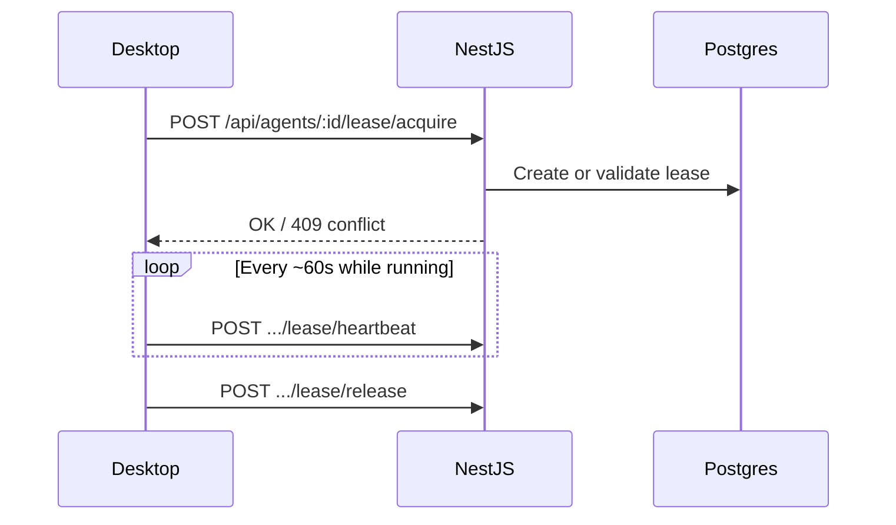

# Device lease

Prevents two desktops from running the **same agent** concurrently against one cloud account.

**Postgres:** `DeviceLease` model (`backend/prisma/schema.prisma`)  
**API:** `backend/src/agents/agents.controller.ts`  
**Desktop:** `desktop/electron/runtime-manager.ts` acquires on start, heartbeats while running

---

## Why it exists

Agent state lives on **local disk** (`data/agents/{runtimeAgentId}/`). If two machines loaded the same agent, memory and workspace would diverge.

The lease grants **exclusive** access to one `deviceId` (stable desktop fingerprint) per agent.

---

## Flow

---

## API (NestJS)

| Method | Path | Purpose |
|--------|------|---------|
| GET | `/api/agents/:id/lease` | Current lease holder |
| POST | `/api/agents/:id/lease/acquire` | Take lease (`deviceId`, `deviceName`) |
| POST | `/api/agents/:id/lease/release` | Release (optional chain metadata) |
| POST | `/api/agents/:id/lease/force-acquire` | Steal lease (user confirmed) |
| POST | `/api/agents/:id/lease/heartbeat` | Keep-alive |

---

## UX

- Second desktop sees conflict → offer force-acquire or use another agent
- Web UI can show which device holds the agent (future dashboard detail)

---

## Related

- [Database schema](../reference/database-schema.md)
- [Desktop app](desktop.md)
- [Deployment topologies](deployment-topologies.md)
