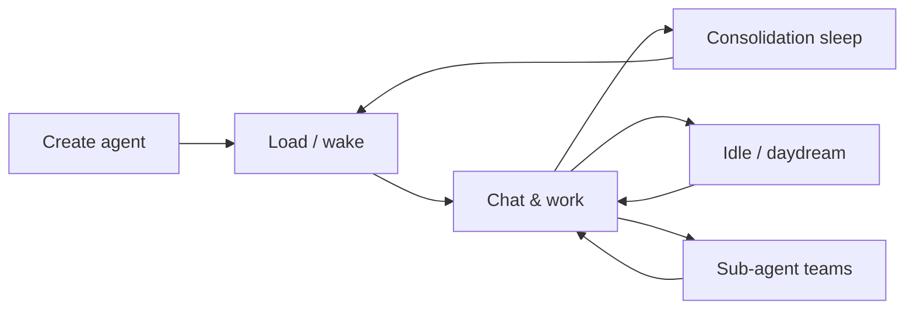

# Agent lifecycle

From creation through daily use, sleep, and long-term growth.

---

## Lifecycle overview

---

## 1. Creation

**UI:** Dashboard → New Agent → `/create` — choose genesis path and name.

**API:** `POST /agents` with genesis version (default `standard-v1`).

**Runtime steps** (`server/services/agent_manager.py`):

1. Allocate `agent_id` and directory under `data/agents/`
2. Copy genesis config + default state from `data/genesis/standard-v1/`
3. Initialize empty DomainDB, Cryptex, event stores
4. Register with NestJS backend (agent registry)
5. Load runtime hooks (skills discovery, MCP reconnect)

Creation takes **seconds** — no model download or training.

See [Genesis templates](genesis.md).

---

## 2. Load and wake

When you open chat or send a channel message:

1. **AgentManager** loads agent state from disk
2. Cryptex rings hydrate from persistence
3. Skills register tools (bundled + installed + MCP)
4. Consciousness scheduler marks agent **CONSCIOUS** (or wakes from FROZEN)
5. WebSocket session attaches

If the agent was **sleeping**, user messages queue wake after current phase completes or preempt per policy.

---

## 3. Living — chat and projects

During active use:

- Each turn runs the [agentic loop](../guides/agentic-loop-and-plans.md)
- Signals update hormones and learning buffer
- Facts write to working memory and DomainDB
- Plans and teams update project rings
- Channel messages interleave with web chat on the same brain

---

## 4. Delegation waves

For multi-step work:

1. Orchestrator creates a **plan**
2. **Team** tool launches sub-agents per delegatable step
3. Teams persist in `teams/team_{id}.json` — survive restarts
4. Timeline UI reflects wave state
5. Parent merges results and continues plan

Sub-agents use **SubCryptex** — isolated memory, inherited fixed rings.

---

## 5. Sleep

Triggers:

- Circadian schedule (bedtime / nap)
- Signal buffer threshold
- Manual `/sleep`

Cycle:

1. **DROWSY** — finish current turn if needed
2. **SLEEPING** — consolidation (LLM summaries, fact merge)
3. **WAKING** — reload clean buffers
4. **AWAKE** — ready for chat

Details: [Sleep & consolidation](../guides/sleep-and-consolidation.md).

---

## 6. Idle and daydream

With no active user session:

- **Drive engine** builds pressure (curiosity, social, etc.)
- **DMN** may run passive or active dreams
- Todo **intentions** can enqueue idle work
- New signals feed the next sleep

Visible on **Brain** dashboard when active.

---

## 7. Freeze and unload

Under memory or concurrency pressure, **ConsciousnessScheduler** may **freeze** agents:

- State flushed to disk
- Zero GPU/CPU for inner loop
- User message → immediate wake

---

## 8. Deletion

Deleting from Dashboard:

1. NestJS removes registry entry
2. Runtime shutdown for agent id
3. Optional disk wipe of `data/agents/{id}/`

Channel integrations should be disconnected first to avoid orphaned webhooks.

---

## Related

- [Genesis templates](genesis.md)
- [Persistence](persistence.md)
- [Consciousness scheduler](consciousness-scheduler.md)
- [Core concepts](../getting-started/concepts.md)
