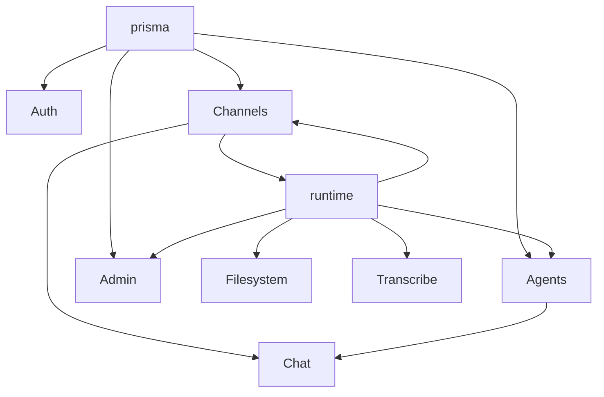

# NestJS modules

Per-module reference for `backend/src/`. Global HTTP prefix: **`/api`**.

**Parent:** [NestJS backend](../nestjs-backend.md) · **Routes:** [NestJS API](../../reference/nestjs-api.md)

---

## Module index

| Module | Role |
|--------|------|
| [Prisma](prisma.md) | Global PostgreSQL client |
| [Auth](auth.md) | Register, login, JWT |
| [Users](users.md) | Internal user profile service |
| [Agents](agents.md) | Agent CRUD, runtime proxy, leases, soul |
| [Runtime](runtime.md) | HTTP/WS client to Python |
| [Chat](chat.md) | Socket.IO chat gateway |
| [Channels](channels.md) | Relay, email, webhooks, pending queue |
| [Runtime proxy](runtime-proxy.md) | `/api/rt/*` relay catch-all |
| [ClawHub](clawhub.md) | Marketplace search/install |
| [Filesystem](filesystem.md) | IDE `/api/fs/*` proxy |
| [Terminal](terminal.md) | User PTY (not agent shell) |
| [Transcribe](transcribe.md) | Audio upload → Python |
| [Admin](admin.md) | Platform admin + runtime introspection |
| [API keys](api-keys.md) | User automation keys |
| [Babo Cloud](babo-cloud.md) | Inference + GPU relay, BYOK keys, subscriptions |
| [Settings](settings.md) | Per-user JSON preferences |

---

## Dependency graph



---

## Environment variables (shared)

| Variable | Used by |
|----------|---------|
| `DATABASE_URL` | prisma |
| `JWT_SECRET`, `JWT_REFRESH_*` | auth, chat, terminal |
| `RUNTIME_URL`, `RUNTIME_SHARED_SECRET` | runtime, channels, relay WS |
| `RESEND_API_KEY`, `RESEND_INBOUND_DOMAIN` | channels |

---

## Relay WebSocket (not a Nest module)

Registered in `backend/src/main.ts`:

```http
WS /api/channels/relay/{runtimeAgentId}?secret=
```

See [Channels](channels.md) and [Relay protocol](../../reference/relay-protocol.md).
