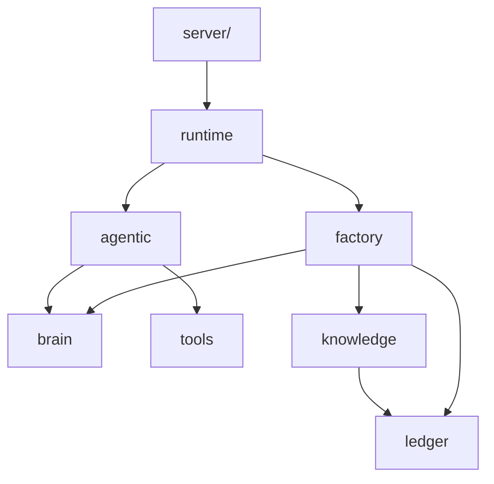

# NLS modules

Per-package reference for the agent brain (`nls/`). HTTP/WebSocket lives in **`server/`**, which imports these packages.

**Parent:** [nls package map](../nls-package-map.md) · **Runtime:** [Agent runtime](../agent-runtime.md)

---

## Package index

| Package | Role |
|---------|------|
| [Runtime](runtime.md) | `AgentRuntime`, factory, channels relay client |
| [Agentic](agentic.md) | Multi-step loop, plans, teams, delegates |
| [Brain](brain.md) | ANS, hormones, Cryptex, DMN, drives |
| [Engine](engine.md) | Inner loop, events, thalamic router, tool registry (shims + core) |
| [Tools](tools.md) | Agent tools, MCP, browser, scheduler |
| [Skills](skills.md) | Skill SDK + bundled integrations |
| [Identity](identity.md) | Soul, narrative, theory of mind |
| [Ledger](ledger.md) | Merkle chain, genesis, soul packages |
| [Knowledge](knowledge.md) | FactStore, taxonomy classification |
| [Bridge](bridge.md) | AKU validation, cloud/local extraction |
| [Config](config.md) | `NLSSettings`, JSON brain defaults |
| [Taxonomy](taxonomy.md) | Domain seed YAML |
| [Models](models.md) | Shared Pydantic types (`nls/models.py`) |

**Inactive dirs:** `miner/`, `training/`, `analytics/` (no product code).

---

## Dependency sketch

---

## Server import map

| `server/` module | Primary `nls` imports |
|------------------|----------------------|
| `agent_manager.py` | `runtime`, `ledger.genesis` |
| `consciousness_scheduler.py` | `engine.inner_loop`, `brain.self_state` |
| `skill_loader.py` | `skills`, `tools` |
| `routes/admin.py` | `ledger`, `brain`, `tools` |
| `routes/skills.py` | `agentic`, `tools` |
| `routes/teams.py` | `agentic.plan_store` |
| `main.py` | `runtime.channels`, `tools.scheduler` |
