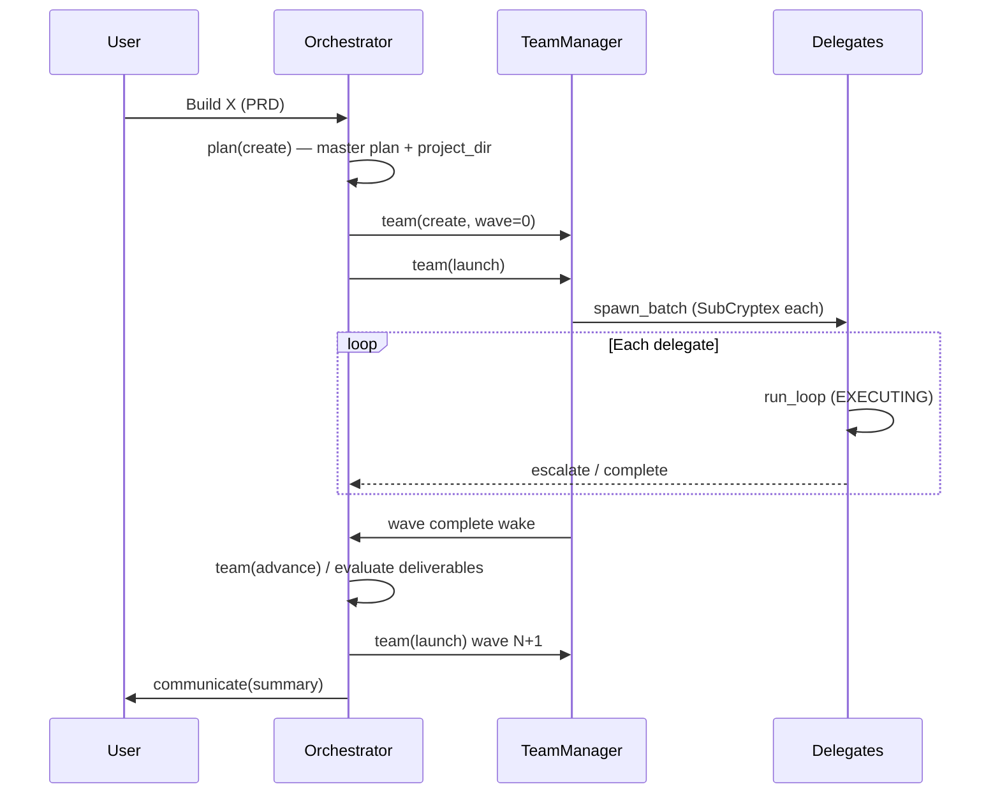

# Orchestration & delegation

How Babo runs **multi-step projects** with an orchestrator agent, **team waves**, and isolated **delegate loops**.

**Code roots:** `nls/agentic/` · **User guide:** [Agentic loop & plans](../guides/agentic-loop-and-plans.md)

---

## Roles

| Role | Who | Does | Must not |
|------|-----|------|----------|
| **Orchestrator** | Main agent loop (`coordinator_mode=true`) | Plan, Kanban, `team(create/launch/advance)`, hints, accept partial | Implement delegatable steps with `bash`/`write` while wave runs |
| **Delegate** | Sub-agent (`run_delegate_detached`) | Execute one plan step / sub-plan | Create plans, message user directly, spawn teams |
| **User** | Human | Goals, credentials, approvals | — |

The orchestrator is an **engineering manager**; delegates are **IC engineers**.

---

## Lifecycle

---

## Agent modes & tool policy

Modes (`nls/agentic/types.py` → `AgentMode`) gate which tools appear in the schema list.

| Mode | Orchestrator use | Primary tools |
|------|------------------|---------------|
| `planning` | Decompose PRD, `plan(create)` | `plan`, `todo`, `read`, `semantic_search` |
| `delegating` | `team(create)`, `team(launch)` | `team`, `plan`, `delegate_ring` |
| `monitoring` | Wait for wave; handle escalations | `team`, `await_delegates`, `communicate` |
| `evaluating` | Review artifacts, `plan(verify/complete)` | `plan`, `read`, `team(inspect/intervene)` |
| `executing` | Solo work (no active delegatable plan) | Full IC toolkit |
| `responding` | Answer user while teams run in background | Comms + skills + `switch_mode` back |

**Policy engine:** `orchestration_policy.py`

- `resolve_allowed_tools()` — mode + coordinator phase → frozenset of tool names
- `refresh_tool_schemas()` — strips IC tools from orchestrator during active waves
- Wake messages — compact system injections on scheduler / escalation / wave complete

**Mode transitions:** `tool_mode_policy.py` — successful `team(launch)` → MONITORING, etc.

---

## Teams & waves

**Team tool** (`nls/tools/agent_tools/team.py`) + **TeamManager** (`team_manager.py`).

| Concept | Description |
|---------|-------------|
| **Wave** | One batch of delegates for a set of plan steps with satisfied dependencies |
| **Member** | Single delegate bound to a step label |
| **Completion review** | Orchestrator must `team(intervene, decision=approve)` before member marked done |
| **Auto-advance** | Policy may launch next prepared wave when no active delegates |

**Wave coordination** (`wave_coordination.py`): file ownership blocks, tech stack hints injected into delegate SubCryptex.

### Wave selection and create guards

`team(create)` supports explicit wave index or **`wave=auto`** — resolves to the next wave with pending delegatable steps via `next_pending_wave_index()`.

| Guard | Error flag | Recovery |
|-------|------------|----------|
| Duplicate team for same plan+wave | `duplicate_team` | Launch existing team |
| Skipped prior wave still active | `skipped_pending_wave`, `recommended_wave` | `team(advance)` then create |
| Prior wave finished but not advanced | `wave_needs_advance` | Advance before next create |
| Deploy prerequisites unmet | `deploy_blocked` | Complete deploy step first |
| Rapid recreate same wave without launch | `duplicate_wave_recreate` | Use `force_retry` or advance |
| Launch with unmet step dependencies | `needs_delegate_spawn` | Satisfy plan deps |

Breadcrumb engine injects `[BREADCRUMB]` hints on these errors so the orchestrator self-corrects (launch, advance, await_delegates).

**Pending launch:** Successful `team(create)` sets `pending_launch_team_id` until `team(launch)`. Coordinator guards block `switch_mode(executing)` until launch completes.

---

## Delegate runtime

Each delegate runs `run_loop()` with:

| Isolation | Mechanism |
|-----------|-----------|
| Memory | **SubCryptex** — task, progress, knowledge, skills (borrowed from parent) |
| Tools | `_DELEGATE_EXCLUDED` — no `plan`, `team`, channel sends, `ask_user` |
| CWD | Plan `project_dir` pre-set on bash + file tools |
| Budget | `max_steps` / iteration cap; `escalate()` for more budget or auth help |
| Hints | Orchestrator `team(hint)` → steering queue → next delegate iteration |

**Hint delivery modes** (`orchestrator_hint.py`):

| Mode | Behavior |
|------|----------|
| `both` (default) | SubCryptex orchestrator ring + `[ORCHESTRATOR HINT]` chat interrupt |
| `ring` | Ring-only; no chat steering message |

Delegate's next prose triggers a **hint ack** back to TeamManager — surfaced in Projects Teams panel as **Last response**. Duplicate hints may be suppressed per `team_hint_policy`.

**Executor entry:** `run_delegate_detached()` in `executor.py`.

---

## Escalation & hints

Delegates call virtual tool `escalate(reason, message)` when blocked (auth, budget, file access).

| Orchestrator action | When |
|---------------------|------|
| `team(intervene, decision=extend)` | Delegate needs more iterations |
| `team(intervene, decision=hint)` | Concrete next step (e.g. gh auth command) |
| `team(grant_paths)` | File access request |

Wake source `team_member_escalation:` injects priority system message. See orchestration policy `build_orchestration_wake_message()`.

---

## Plans & Kanban

**PlanStore** (`plan_store.py`) + **plan_work** / **plan_goal_hygiene**:

- Master plan with `project_dir`, `tech_stack`, step dependencies
- Sub-plans for complex steps
- Todo board sync via todo-list skill (delegates read-only)
- Recovery helpers for failed / partial steps

Rule: **one user request → one master plan → one project folder**.

---

## Coordinator guards

`coordinator_guard.py` prevents common failure modes:

- Orchestrator implementing delegatable steps after `team(launch)`
- Raw `delegate()` when plan requires team delegation
- Plan completion while steps still pending
- **`switch_mode(executing)`** while `pending_launch_team_id` set, non-terminal teams exist, or completion review pending — must launch/monitor/advance first
- **`plan(create)` solo circumvention** — blocking new plans where every step has `delegatable=false` while an active team plan still has pending delegatable steps (`incoming_plan_steps_are_solo_circumvention`)
- **Implementation tools blocked** (`bash`/`write` with create patterns) when team plan or build goals active — unless evaluating mode or orchestrator recovery

When circumvention is detected, the plan tool returns a block message listing pending delegatable steps and instructs the orchestrator to use `team(create/launch)` instead of rebuilding a solo plan.

**Monitoring soft guard:** `team(advance)` may require a recent `team(inspect)` on the same team id.

---

## Plan triage & orchestration floor

`plan_triage_policy.py` ties turn triage to active plan state:

| Mechanism | Behavior |
|-----------|----------|
| `plan_requires_orchestrated_profile()` | True when a plan has multiple delegatable steps or active team waves |
| `active_plan_orchestration_floor()` | Returns `orchestrated` when EM infrastructure is required |
| `apply_orchestration_floor()` | Never let triage/profile drop below the floor |
| `enforce_loop_profile_for_active_plan()` | Re-applies floor on **every loop entry** after job/trust resolve |
| `boost_triage_for_active_plan()` | Lifts triage toward `orchestrated` when teams already exist |
| `build_plan_triage_continuation_block()` | Injects profile hint when triage is skipped but plan needs EM |

User profile picks in the chat chip (`apply_user_profile_override`) respect the floor — UI shows when an override was raised. Triage goals for orchestrated plans are shaped toward delegation (`goals.py`).

---

## Related modules

| File | Role |
|------|------|
| `wake_coordination.py` | Scheduler wakes, token budget |
| `orchestrator_hint.py` | Hint formatting, delivery modes, ack path |
| `breadcrumbs.py` | Post-tool steering (create→launch→monitor, wave errors) |
| `team_advance_hints.py` | Advance / completion review nudges |
| `outbound_notify.py` | Channel notifications on milestones |
| `resume_guidance.py` | Post-crash loop resume |
| `delegate_manager.py` | Active delegate registry |
| `bridge.py` | `LoopHooks`, Cryptex `compose_context` each iteration |

---

## Squads (persistent fleet)

Separate from **Teams** above: **Squads** coordinate **multiple full agents** via `SquadManager`, `squad` tools, and the `squad_lead` profile. Work flows through a shared **inbox** (propose → lead approve → member todos). Event-driven wakes use `squad_checkback`, `squad_escalation`, and `squad_item_done` dispatch sources.

**Guide:** [Job, Trust & Squads](../guides/job-trust-and-squads.md) · **API:** [Job, Trust & Squad API](../reference/job-trust-squad-api.md)

---

## Further reading

- [Agentic loop](agentic-loop.md)
- [nls/agentic module](nls-modules/agentic.md)
- [Sequence: agentic loop](sequences/agentic-loop.md)
- [Skill discovery & recovery](skill-discovery-and-recovery.md)
- [Job, Trust & Squads](../guides/job-trust-and-squads.md)
