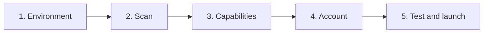

# Production architecture & onboarding (final)

One-page map for **shipping Babo desktop** to all users—not a single homelab layout. Use this for release testing and to track **shipped today** vs **target onboarding**.

**Deep dives:** [Deployment topologies](deployment-topologies.md) · [Capability profiles](capability-profiles-and-onboarding.md) · [Vision worker](vision-worker.md)

---

## Production stack (what every user runs)

```text
┌─────────────────────────────────────────────────────────────────────────┐
│  CONTROL PLANE (cloud)                                                   │
│  NestJS + Postgres — accounts, agents, relay, channels, settings        │
│  Angular web (optional) — remote dashboard when desktop hub is online   │
└───────────────────────────────┬─────────────────────────────────────────┘
                                │ HTTPS + Socket.IO relay (outbound WS)
                                ▼
┌─────────────────────────────────────────────────────────────────────────┐
│  DATA PLANE (user machine — Babo Desktop)                                │
│  Electron + Angular UI                                                   │
│  Python runtime :9222 — agent loop, memory, tools, sleep, skills       │
│                                                                          │
│  Four optional model workloads (each independently placed):              │
│    ① Inference      — chat, tools, sleep (HTTP OpenAI-compatible)      │
│    ② Visual Cortex — ambient desktop eyes (small VLM only if enabled)  │
│    ③ Transcribe     — voice input (Whisper local or remote)              │
│    ④ Embeddings     — semantic_search (optional)                         │
└───────────────────────────────┬─────────────────────────────────────────┘
                                │
        ┌───────────────────────┼───────────────────────┐
        ▼                       ▼                       ▼
   This PC                 My LAN server            Cloud / hosted
 (Ollama, Moondream)      (GX10 vLLM, :8450        (OpenRouter BYOK,
                          vision container)         Babo vision API future)
```

**Principles**

1. **Local-first** — this PC or my server before cloud.  
2. **Composable** — four workloads, four placements.  
3. **Multimodal LLM ≠ ambient eyes** — big model for thinking; Moondream-class only for background screen loop when user opts in.  
4. **Hub pattern** — weak laptop + strong LAN box is first-class (not a hack).

---

## The four workloads (user language)

| # | Internal name | Settings label | What the user gets |
|---|---------------|----------------|-------------------|
| ① | `inference` | **Brain (chat model)** | Agent replies, tools, sleep consolidation |
| ② | `visual_cortex` | **Ambient desktop vision** | Optional always-on screen awareness (`eyes`, buffer) |
| ③ | `transcribe` | **Voice input** | Microphone → text in chat |
| ④ | `embeddings` | **Code search (semantic)** | “Find code by meaning” (optional, dev-heavy) |

**On-demand images** (attach screenshot, one-shot look) use **①** when the model is multimodal. **②** only when they enable ambient vision.

---

## Placement options (every workload card)

Each card offers the same **destinations** (disabled options hidden when impossible):

| Destination | UI label | Meaning |
|-------------|----------|---------|
| `self_local` | **This computer** | Runs on the machine with Babo Desktop |
| `self_lan` | **My server** | User’s GX10, NUC, Docker host on LAN |
| `byok_cloud` | **My API key** | OpenRouter, OpenAI, etc. |
| `hosted_babo` | **Babo hosted** | Our endpoint (when available) |
| `off` | **Off** | Feature disabled |

Recommendation badge: **Recommended** on one choice per card after scan.

---

## Vision architecture (final)

```text
                    AMBIENT (optional, user toggle)
                    ─────────────────────────────
  Screen capture ──► Small VLM ──► Visual buffer ──► agent / thalamus
                     Tier 1: Moondream subprocess (desktop)
                     Tier 2: LAN :8450 Moondream container (GX10)
                     Tier 3: Babo hosted /vision/describe (future)

                    ON-DEMAND (no extra model if multimodal)
                    ───────────────────────────────────────
  User attaches image / screenshot to chat ──► Chat LLM (① inference)
```

**Default for multimodal users (e.g. Qwen3.6 on vLLM):** ambient **off**; no Moondream load.  
**When ambient on:** Moondream (local or LAN)—**never** poll the 30B model every 1–3 s.

---

## Personas (production scenarios)

| Persona | Hardware | ① Brain | ② Ambient | ③ Voice | ④ Code search |
|---------|----------|---------|-----------|---------|---------------|
| **Power desktop** | 16GB+ VRAM, 32GB+ RAM | Local Ollama or BYOK | Off or local Moondream | Local Whisper | Off or local |
| **Hub + laptop** | Weak PC + GX10/vLLM | LAN `:8000` | Off or LAN `:8450` / local Moondream on PC | Local mic | Off |
| **Mac 8GB** | M1, 8GB | BYOK or LAN | Off (default) | Local CPU | Off |
| **Cloud-only** | No GPU | BYOK or Babo hosted | Off or Babo hosted | Hosted / off | Off |
| **Developer** | Any + big repo | Any | Per preference | Local | Local or LAN embed |

Your homelab = **Hub + laptop** row with ambient off by default, Moondream local when toggled on.

---

## Onboarding UX (target — what users should see)

### Flow overview



**Today (shipped):** steps 1 partial, 3 partial (inference only), 5 — see [Shipped vs target](#shipped-vs-target-for-release-testing).

---

### Step 1 — Environment

**Title:** Prepare Babo on this computer  

**Copy:** We install a private Python environment for the agent runtime (memory, tools, optional vision models).

- Progress bar + logs (existing).  
- Outcome: **Python ready** ✓  

No capability choices yet.

---

### Step 2 — Scan this device (new)

**Title:** What can this computer run?

**Layout:** Two columns after ~5 s scan.

**Left — This device**

```text
  GPU      NVIDIA GeForce RTX 4080 · 16 GB VRAM
  Memory   64 GB RAM
  Platform Windows 11

  ✓ Can run Moondream for ambient vision
  ✓ Can run voice recognition locally
  ~ Best for smaller chat models locally; use a server or cloud for larger models
```

**Right — Network (optional)**

```text
  [ Scan my network ]  or  Server address: [ 192.168.68.96 ]

  Found on LAN:
    ✓ Chat model    http://192.168.68.96:8000  — Qwen3.6-35B-A3B-FP8
    ○ Voice server  http://192.168.68.96:4443  — Whisper (optional)
    ○ Vision server http://192.168.68.96:8450   — not found (coming soon)
```

**Footer:** [ Continue ] — no placements saved yet; scan feeds recommendations.

---

### Step 3 — Capabilities (new — core screen)

**Title:** Set up your agent capabilities  

**Subtitle:** Choose where each feature runs. We recommend options based on your scan—you can change anything.

#### Card A — Brain (chat model) **required**

```text
  ┌─────────────────────────────────────────────────────────────┐
  │ 🧠 Brain (chat model)                                        │
  │ Powers conversation, tools, and memory consolidation.        │
  │                                                              │
  │  ◉ Recommended · My server                                 │
  │     http://192.168.68.96:8000/v1                            │
  │     Model: [ Qwen/Qwen3.6-35B-A3B-FP8 ▼ ]  [ Test ] 142 ms  │
  │                                                              │
  │  ○ This computer — Ollama at http://127.0.0.1:11434/v1      │
  │  ○ My API key — OpenRouter / OpenAI  [ API key _______ ]    │
  │  ○ Babo hosted — larger models (when available)              │
  └─────────────────────────────────────────────────────────────┘
```

If registry/probe says model is **multimodal**, show hint:  
*“This model can understand images you send in chat.”*

#### Card B — Ambient desktop vision **optional**

```text
  ┌─────────────────────────────────────────────────────────────┐
  │ 👁 Ambient desktop vision                          [ OFF │ ON ] │
  │ Lets Babo notice what’s on your screen in the background.   │
  │ Uses a small vision model—not your main chat model.           │
  │                                                              │
  │  When ON:                                                    │
  │  ◉ Recommended · This computer (Moondream)                   │
  │  ○ My server — http://192.168.68.96:8450  (unavailable)     │
  │  ○ Babo hosted vision                                        │
  │                                                              │
  │  When OFF:                                                   │
  │  You can still send screenshots in chat if your brain model  │
  │  supports images.                                            │
  └─────────────────────────────────────────────────────────────┘
```

**Toggle default:** OFF if multimodal brain + scan tier B/C; ON only if user explicitly enables.

#### Card C — Voice input

```text
  ┌─────────────────────────────────────────────────────────────┐
  │ 🎤 Voice input                                               │
  │  ◉ Recommended · This computer (private, low latency)        │
  │  ○ My server — http://192.168.68.96:4443                     │
  │  ○ Babo hosted                                               │
  │  ○ Off                                                       │
  └─────────────────────────────────────────────────────────────┘
```

#### Card D — Semantic code search **optional, collapsed**

```text
  ▶ Advanced: Semantic code search (optional)
     ○ Off  ◉ This computer  ○ My server  ○ Babo hosted
```

#### Experience summary strip

```text
  ┌─────────────────────────────────────────────────────────────┐
  │ Your experience                                              │
  │  Chat & tools        ✓  via My server (Qwen3.6)             │
  │  Voice               ✓  This computer                      │
  │  Ambient vision      —  Off                                  │
  │  Code search         —  Off                                  │
  └─────────────────────────────────────────────────────────────┘
```

**Actions:** [ Back ] [ Continue ]

---

### Step 4 — Account & backend (existing, lightly merged)

**Title:** Connect to Babo cloud  

- NestJS URL (auth, relay, remote web).  
- Login or “continue offline” if product allows.  

Maps to `NESTJS_URL` — unchanged from today.

---

### Step 5 — Test & launch

**Title:** Ready to launch  

Run quick checks:

| Check | Status |
|-------|--------|
| Python runtime | ✓ |
| Brain connection | ✓ 142 ms |
| Voice (optional) | ✓ or skipped |
| Ambient vision (if on) | ✓ warmup / skipped |

**Summary table** (same as experience strip).  

[ Launch Babo ] → start uvicorn, mark `setupComplete`, route to app.

**Post-launch:** Settings → Capabilities can reopen the same four cards without reinstalling Python.

---

## Settings (post-onboarding)

**Settings → Capabilities** mirrors Step 3 so users can:

- Point brain to a new Ollama model.  
- Turn ambient vision on (triggers Moondream prefetch/warmup).  
- Switch voice to hosted if local Whisper fails.

---

## Shipped vs target (for release testing)

| Area | Shipped today | Target (production onboarding) |
|------|---------------|--------------------------------|
| Wizard steps | **5:** Environment → Scan → Capabilities → Account → Launch | Settings → Capabilities (future) |
| Device scan | IPC `capabilities:scan-device` | — |
| LAN discovery | IPC `capabilities:probe-lan` | — |
| Capability cards | Four cards + ambient toggle + experience strip | — |
| `capabilityProfile` in config | Persisted; `getRuntimeEnv()` wired | — |
| Ambient default | Off unless user enables; Moondream prefetch on enable only | — |
| Multimodal detection | `model-capabilities.json` + UI hint | — |
| GX10 vision `:8450` | LAN probe (shows unavailable until container ships) | Docker image |
| Babo hosted vision | UI option (not functional until hosted API) | NestJS auth |

---

## Config written at end of onboarding (target)

`userData/nls-config.json`:

```json
{
  "inferenceUrl": "http://192.168.68.96:8000/v1",
  "inferenceModel": "Qwen/Qwen3.6-35B-A3B-FP8",
  "inferenceApiKey": "",
  "nestjsUrl": "https://api.babo.example",
  "runtimePort": 9222,
  "setupComplete": true,
  "capabilityProfile": {
    "version": 1,
    "inferenceCapabilities": { "multimodal": "true", "source": "registry" },
    "inference": { "tier": "self_lan", "url": "http://192.168.68.96:8000/v1", "model": "Qwen/Qwen3.6-35B-A3B-FP8" },
    "visualCortex": { "tier": "off", "strategy": "off" },
    "transcribe": { "tier": "self_local" },
    "embeddings": { "tier": "off" }
  }
}
```

Runtime env + default agent `visual_cortex.json` generated from `capabilityProfile`.

---

## Implementation order (suggested)

1. **Scan IPC** — `device:scan` + optional `lan:probe` from Electron.  
2. **Capabilities step UI** — four cards, experience strip, persist profile.  
3. **Wire profile → env** — `config-manager`, `factory.py` gpu worker URL.  
4. **Ambient toggle** — default off; skip Moondream prefetch when off.  
5. **GX10 vision container** + LAN probe for `:8450`.  
6. **Babo hosted** tiers + NestJS auth.

---

## Related files

| File | Role |
|------|------|
| `desktop/electron/capability-types.ts` | Profile types |
| `nls/config/capability-profile.schema.json` | JSON schema |
| `nls/config/model-capabilities.json` | Multimodal registry |
| `docs/architecture/vision-worker.md` | Moondream tiers |
| `frontend/.../setup/setup.component.ts` | Current wizard (to extend) |
