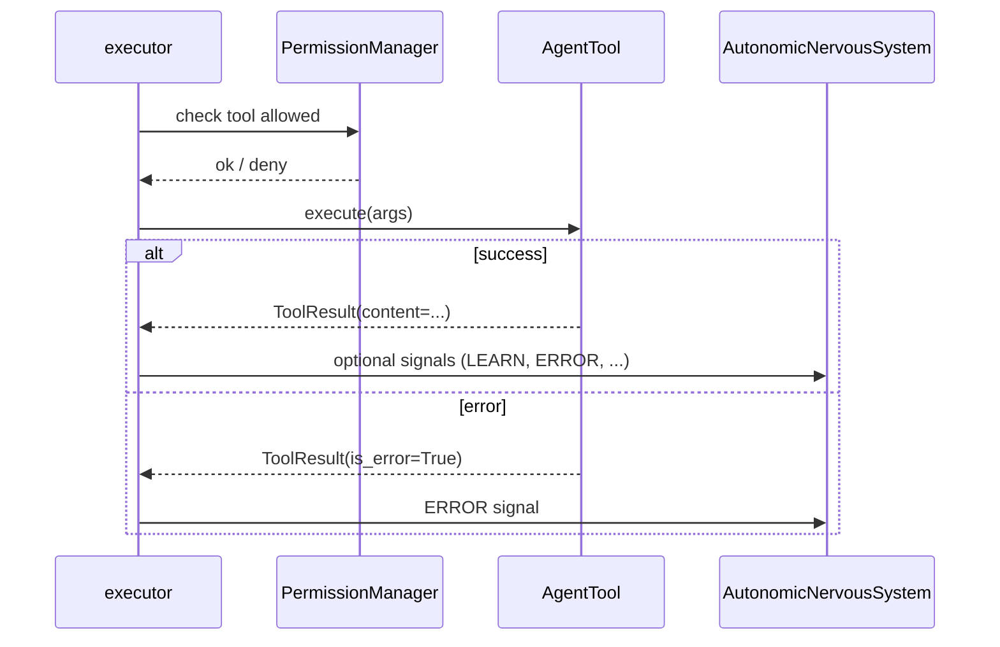

# Sequence: agentic loop (one user turn)

What happens inside **one** agentic chat turn on the desktop runtime (`process_message_agentic_async`).

---

## High-level

```mermaid
sequenceDiagram
    participant WS as Chat WS / Relay
    participant RT as AgentRuntime
    participant Loop as agentic.run_loop
    participant Gen as generator
    participant Exec as executor
    participant Eval as evaluator
    participant Tools as agent_tools
    participant LLM as Inference API
    participant Brain as ANS / Cryptex / DomainDB

    WS->>RT: user message
    RT->>RT: _run_agentic_locked() mutex
    RT->>Loop: run_loop(config, hooks)
    loop Gen/Eval/Exec
    Loop->>Gen: generate(messages, tools schema)
    Gen->>LLM: POST chat/completions
    LLM-->>Gen: text + optional tool_calls
    alt has tool calls
        Loop->>Exec: execute_tools()
        Exec->>Tools: bash, read, plan, ...
        Tools-->>Exec: ToolResult
        Exec-->>Loop: tool messages
        Loop->>Eval: should_complete()
        Eval-->>Loop: continue / complete
    end
    Loop->>Brain: hooks persist hormones, WM, LEARN
  Loop-->>RT: LoopResult
    RT-->>WS: stream events → response_end
```

---

## Step detail (typical DEEP turn)

```mermaid
sequenceDiagram
    participant Loop as run_loop
    participant Hooks as bridge.LoopHooks
    participant Think as classify_thinking_need
    participant LLM as Inference API

    Loop->>Hooks: on_turn_start
    Loop->>Think: classify_thinking_need(user_input)
    Think->>LLM: ~5 token classification
    LLM-->>Think: TASK_THINK | CHAT_NOTHINK | ...
    Loop->>Loop: build context (Cryptex, facts, soul)
    Loop->>LLM: main generation (tools in schema)
```

---

## Tool execution branch



---

## Compaction & max steps

When context grows, `compactor.py` summarizes older tool results. `LoopConfig.max_steps` (and evaluator `should_complete`) stop the loop.

**Abort:** WebSocket `command: abort` sets abort flag checked between steps.

---

## Inner loop vs user chat

| Path | Trigger | Router |
|------|---------|--------|
| User web chat | `chat_request` / WS message | Full agentic loop immediately |
| Idle / channel event | `InnerLoop` tick | `ThalamicRouter` → MICRO/FOCUS/DEEP |

See [Inner loop](../inner-loop.md). Event depth uses `ThalamicRouter` in `nls/engine/thalamic_router.py` (separate from domain experience tracking).

---

## Event types (UI)

Common WebSocket / Socket.IO `runtime` payloads:

| type | Meaning |
|------|---------|
| `agentic_start` | Loop began |
| `token` | Streaming text chunk |
| `tool_call` | Tool invoked |
| `tool_result` | Tool finished |
| `response_end` | Turn complete |
| `status` | Sleep, abort, errors |

Full list: [WebSocket events](../../reference/websocket-events.md).

---

## Related

- [Agentic loop](../agentic-loop.md)
- [Agent runtime API examples](../examples/agent-runtime-api.md)
- [Agentic package (NLS)](../nls-modules/agentic.md)
