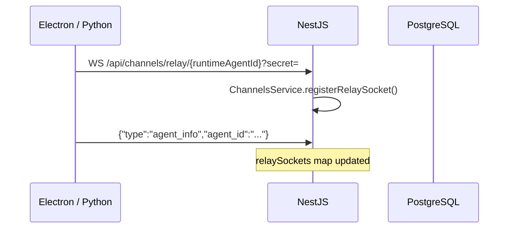
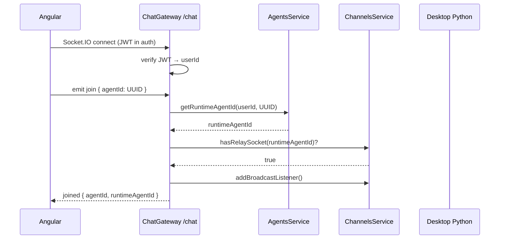
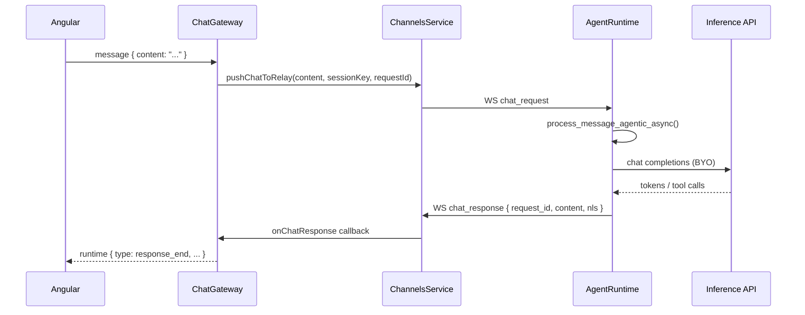
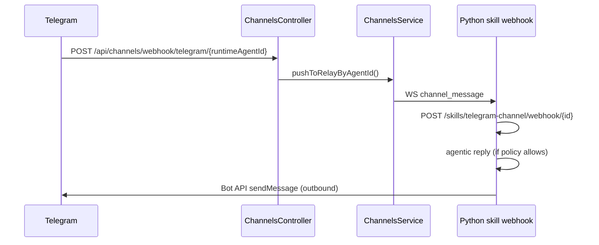
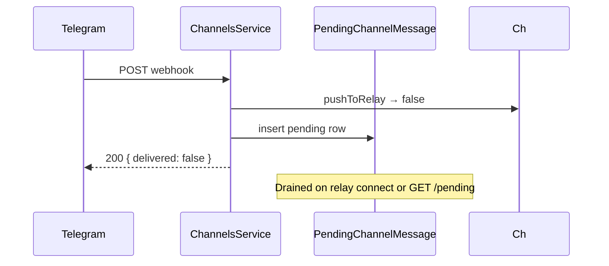

# Sequence: relay registration & web chat join

End-to-end path when a user chats on **hosted web** while the **desktop** runs the Python runtime.

---

## 1. Desktop connects relay

---

## 2. User opens chat in browser

---

## 3. User sends a message (relay mode)

---

## 4. Channel webhook while relay online

---

## 5. Webhook when desktop offline

---

## Related

- [Channels API examples](../examples/nestjs-channels-api.md)
- [Chat module](../nestjs-modules/chat.md)
- [Relay protocol](../../reference/relay-protocol.md)
- [Deployment topologies](../deployment-topologies.md)
