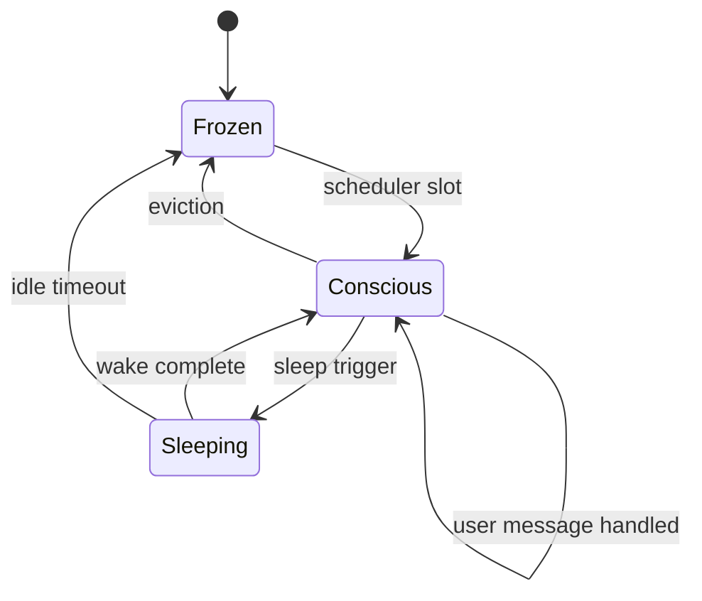

# Sleep & consciousness

Two schedulers manage **offline consolidation** and **autonomous inner loops**.

---

## Sleep scheduler

**File:** `server/services/sleep_scheduler.py`  
**Worker:** `server/services/consolidation_sleep.py`

### Triggers

| Source | Mechanism |
|--------|-----------|
| Signal pressure | ANS `on_sleep_requested` |
| Manual | `/sleep` command or admin POST |
| Voluntary | Agent `request_sleep` tool → drowsy negotiation |
| Circadian | Agent config bedtime windows |
| Post-orchestration | Runtime hooks after large team runs |

### Drowsy negotiation

Before consolidation, high signal load may set the inner loop **drowsy**. The UI prompts the owner; confirm/deny flows through `server/routes/chat/sleep_negotiation.py` (slash commands, drowsy card, agentic text). On timeout (~2 min), sleep proceeds without confirm.

### Pipeline

```text
SleepJob queued (FIFO)
  → _consolidate_async()
  → run_consolidation_cycle(runtime)
        ├── Triage signals
        ├── LLM compound summaries
        ├── Merge facts → DomainDB / Cryptex
        └── Broadcast sleep_* WS events
  → ConsciousnessScheduler.on_sleep_complete()
```

### User preempt

Active chat can **dequeue** or defer sleep (`SleepScheduler` + agent mutex).

---

## Consciousness scheduler

**File:** `server/services/consciousness_scheduler.py`  
**Inner engine:** `nls/engine/inner_loop.py`

### States

| State | Meaning |
|-------|---------|
| CONSCIOUS | Inner loop running (heartbeat + breath) |
| SLEEPING | Consolidation in progress |
| FROZEN | Unloaded from hot path, on disk |

### Slot allocation

Default **max_conscious ≈ 5** agents concurrently.

Priority score weights:

- Time since last conscious
- Drive pressure
- Signal buffer depth
- Cortisol (stress reduces priority)

### User message preempt

`on_user_message()`:

- Interrupts inner loop breath
- Wakes FROZEN agent to handle chat
- User chat always wins over autonomous work

### Inner loop ticks

| Phase | Work |
|-------|------|
| Heartbeat | Math-only hormone/drive decay |
| Breath | DMN sample, drive fires, proactive tool dispatch |

Dispatches use `enqueue_autonomous_dispatch` → may start agentic runs for todos/browser.

Disable: `NLS_CONSCIOUSNESS_ENABLED=false`.

---

## Interaction diagram



---

## Env vars

| Variable | Default | Effect |
|----------|---------|--------|
| `NLS_SLEEP_ENABLED` | true | Sleep scheduler |
| `NLS_CONSCIOUSNESS_ENABLED` | true | Consciousness scheduler |

---

## Related

- [Consciousness scheduler (original doc)](consciousness-scheduler.md)
- [Brain & memory](brain-and-memory.md)
- [Sleep user guide](../guides/sleep-and-consolidation.md)
