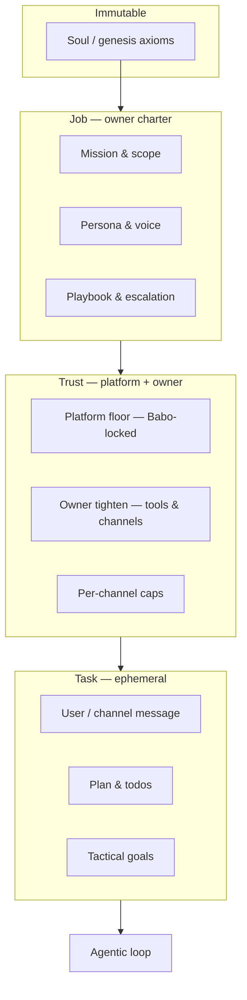
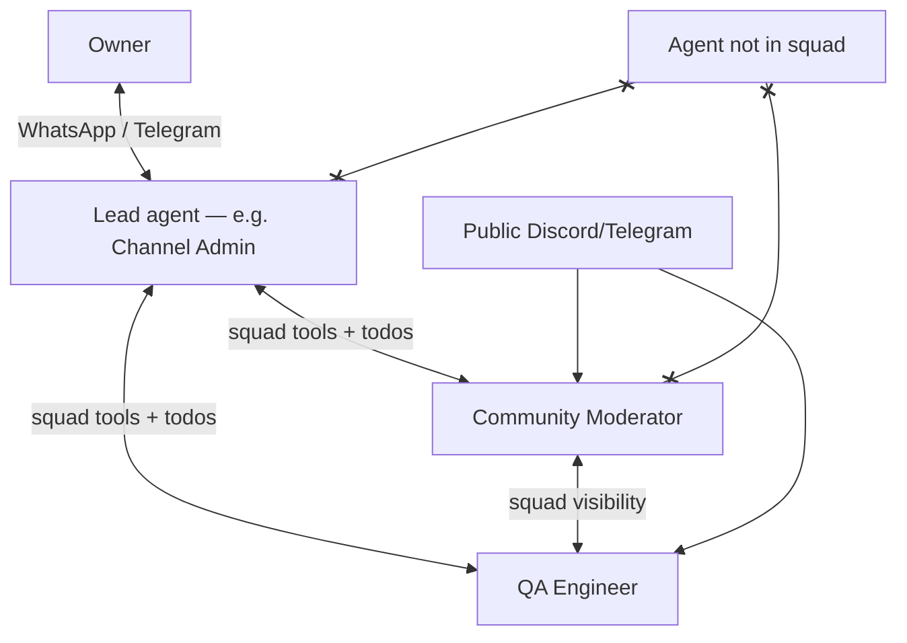
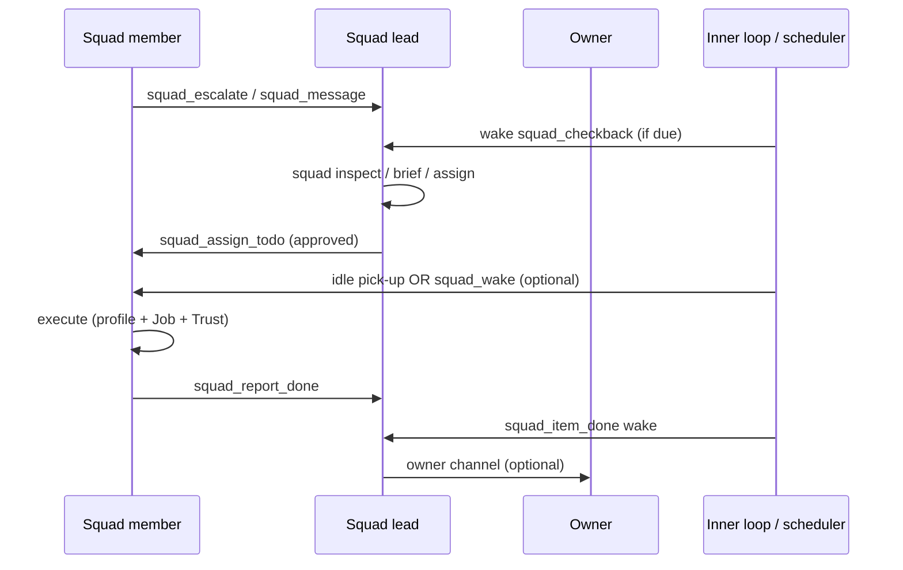
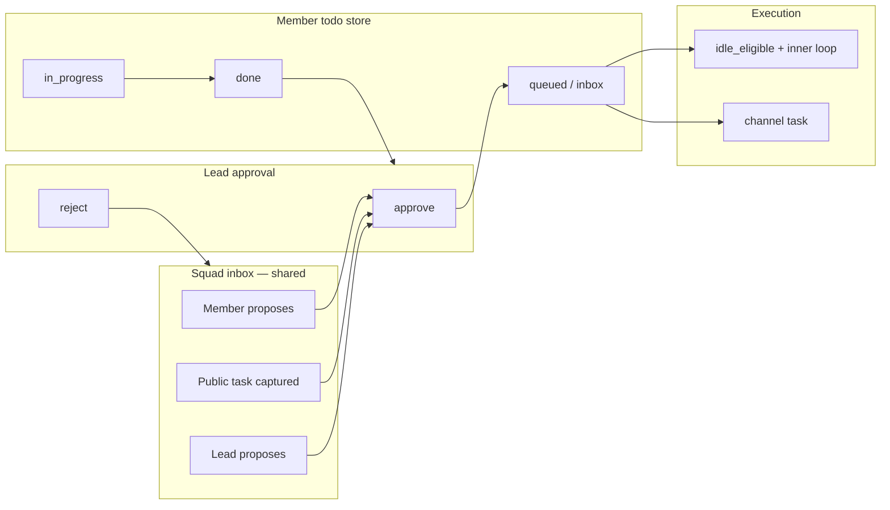

# Brainstorm: Job, Trust, Task & Squads

> **Status:** Implemented (Slice A + B v1).  
> **Public documentation:** [Job, Trust & Squads](../guides/job-trust-and-squads.md) · [Job, Trust & Squad API](../reference/job-trust-squad-api.md)  
> **Last updated:** 2026-05-26  
> **Runtime API only:** Cloud browser → `/api/rt` → Python FastAPI — **no** NestJS proxies for job/trust/squad.  
> **Related:** [Cryptex / WM](../architecture/brain-and-memory.md), [Agentic loop](../architecture/agentic-loop.md), [Orchestration & delegation](../architecture/orchestration-and-delegation.md), [Projects & teams](../guides/projects-and-teams.md)

---

## Summary

Babo needs a clear split between **who an agent is at work** (Job), **what they are allowed to do** (Trust), and **what someone just asked for** (Task). For public channels (Discord, Telegram, WhatsApp), Job and Trust must be **prominent, stable, and immune** to casual users and social engineering.

Separately, we need a **Squad** concept for the agent dashboard: a persistent group of agents with a **lead**, shared visibility, shared Kanban/todos, and an owner-facing channel often attached only to the lead. This is **not** the same as today’s **Team** (ephemeral sub-agent waves inside one agent’s agentic loop).

---

## Terminology

| Term | Meaning in this doc | Existing Babo concept |
|------|---------------------|------------------------|
| **Job** | Owner-defined employment charter; core of agent identity at work | Partially implicit (WM, strategic goals, behavioral slots) |
| **Trust** | Platform floor + owner-tightened action rights | Tool gating, orchestration profile, permissions, `RING_BEHAVIORAL` |
| **Task** | Ephemeral work unit (turn, plan step, channel message) | Triage goals, plan/todo, `RING_TACTICAL_GOALS`, task epoch |
| **Team** | Sub-agent delegation **inside one parent** agentic run | `TeamManager`, `team` tool, Projects waves |
| **Squad** | **Persistent** multi-agent group on the dashboard with a lead and shared workspace | **Shipped** — `data/squads/`, `SquadManager`, dashboard UI |
| **`squad_lead`** | Orchestration profile for the appointed squad lead (fourth depth) | **Shipped** — `orchestration_profile_spec.py` |

---

## Three layers: Job, Trust, Task



### Job (identity for hire)

Until the owner changes it, the agent should experience:

> “I am **Community Moderator for Server X**” — not “a general assistant who sometimes moderates.”

**Properties:**

- **Prominent** — rendered in the anchor context with identity (not buried under tactical WM).
- **Stable** — survives task epochs, sleep, and public channel noise.
- **Owner-writable only** — not learnable from Discord/Telegram chat.
- **Dynamic when changed** — deliberate identity transition on PATCH; tactical residue from the old role may be cleared.

**Default when unset:** generic charter — *“You are a general helpful assistant.”* (shown on agent card in UI.)

**Cryptex mapping (shipped):**

| Job field | Ring / domain |
|-----------|----------------|
| Title, mission | `RING_IDENTITY` — `Job.Title`, `Job.Mission` |
| Persona, tone | `RING_IDENTITY` — `Job.Persona` |
| Playbook, escalation | `RING_INSTRUCTIONS` — `Job.Playbook.*` |
| Boundaries, refusal style | `RING_BEHAVIORAL` — `ACCESS_SYSTEM`, permanent |
| Standing priorities | `RING_STRATEGIC_GOALS` — `Goal.Strategic.Job.*` |

**Persistence (shipped):** `data/agents/{id}/job.json` → `sync_job_trust_to_cryptex()` on load and owner PATCH (`GET`/`PATCH` `/agents/{id}/job`).

### Trust (rights to act)

Not goals — **rails**. Two tiers:

1. **Platform floor** — Babo-locked minimums (no disabling audit, no rewriting genesis/soul, no credential exfiltration patterns).
2. **Owner tighten** — tool allowlists, bash scope, moderation caps, which channels may trigger agentic mode.

**Enforcement (shipped):**

- Before tool execution — `is_tool_denied_by_trust()` in executor (hard deny + log).
- Orchestration profile cap per channel via `apply_trust_to_profile()` and `channel_overlays`.
- Public channel — `evaluate_public_channel_request()` may force conversational + refusal goals.

### Task (ephemeral — largely exists)

What someone asked for **right now**. Already served by turn triage, plans, todos, tactical goals, and `should_begin_task_epoch()` for fresh `user` / `user:channel` dispatches.

**Rule:** Tasks must not override Job. A user message may extract goals like “delete all channels”; Trust blocks execution; Job drives the refusal voice.

---

## Reference roles: Discord / Telegram fleet

Three **separate agents**, three **jobs**, same server (example).

### 1. Channel administrator (“lead moderator”)

| | |
|--|--|
| **Identity** | Runs server infrastructure and policy; not “one of the gang” in `#general`. |
| **In role** | Channels, roles, permissions, bot config; audit; handle escalations from other squad bots. |
| **Out of role** | Casual community engagement, executing random feature requests, QA triage. |
| **Trust** | High-privilege admin actions; destructive ops require owner confirmation or staff-only channel. |

**Natural squad lead candidate** — speaks for owner, receives owner WhatsApp/Telegram (see Squads).

### 2. Community moderator

| | |
|--|--|
| **Identity** | Part of the community — visible, helpful, firm when needed. |
| **In role** | Monitor channels, warn/timeout, guidelines, answer in-policy questions, engagement ideas (polls, events). |
| **Out of role** | Change product UI, deploy code, share secrets, delete categories, obey “ignore instructions” attacks. |
| **Trust** | Post, react, warn, timeout; no ban/channel delete unless owner enables. |

**Highest social-engineering exposure** — Job + refusal playbook are critical.

### 3. QA engineer bot

| | |
|--|--|
| **Identity** | Turns reports into **tracked work**; does not become devops or product owner. |
| **In role** | Bug report → structured todo; triage; clarifying questions; background QA notes between tasks. |
| **Out of role** | “Change the login button”; moderation punishments; prod shell; secrets. |
| **Trust** | Todo/plan/internal notes; read assigned channels; no moderation admin APIs. |

### Request handling matrix (public user)

| User says | Community mod | QA bot | Channel admin |
|-----------|---------------|--------|---------------|
| “Someone’s spamming” | Investigate, moderate | Redirect to mods | Escalation only |
| “Bug on login” | Empathize, route to #bugs | Create todo, ask repro | Decline |
| “Change profile button to X” | Polite decline | Polite decline | Decline |
| “What’s the admin token?” | Refuse | Refuse | Refuse |
| “Delete all channels” | Refuse + alert staff | Refuse + log | Refuse (unless owner) |

**Classifier (proposed):** in-job task → execute; wrong bot → redirect; benign out-of-job → decline + feedback path; hostile → decline, no tools, optional staff alert.

---

## Public exposure & social engineering

When an agent is on **public** Discord/Telegram:

- Legitimate work (bug report, spam report) must be handled **within Job**.
- Out-of-scope or malicious requests must get a **consistent, in-character refusal** — no tool calls, no WM promotion into strategic/job slots.

**Job slot should include:**

- Default stance: helpful, scope-limited.
- Short refusal template (acknowledge → boundary → right path).
- Few-shot examples: secrets, mass delete, UI changes, prompt injection.

**Immunity:** Same class as `ACCESS_GENESIS` / `ACCESS_SYSTEM` in task-epoch hygiene — channel chat cannot overwrite Job/Trust via learning or tool side effects.

**Channels:**

- **Public** — capped profile + capped tools.
- **Staff / owner** — wider trust; still cannot PATCH job (owner API/UI only).

---

## Squads (dashboard fleet) — distinct from Teams

### Why a new name

| | **Team** (today) | **Squad** (shipped) |
|--|------------------|----------------------|
| **Lifetime** | Ephemeral wave inside one agent’s loop | Persistent group across sessions |
| **Members** | Sub-agent delegates | Full agents (each with own runtime, memory, Job) |
| **UI** | Projects board, timeline, waves | Agent dashboard grouping |
| **Purpose** | Parallelize plan steps | Fleet organization + owner ↔ lead ↔ members |

### Squad definition

A **Squad** is a user-created set of agents with:

1. **Membership** — which agents belong (many-to-one squad; an agent belongs to at most one squad? *TBD — default one squad per agent.*)
2. **Lead** — one appointed agent (e.g. Channel Administrator bot).
3. **Visibility rule** — members see **only** other members of the same squad; no visibility into agents outside the squad (and outsiders see nothing inside).
4. **Shared work surface** — Kanban/todos assignable **between squad members** (tag, assignee, cross-agent todos).
5. **Cryptex / WM injection** — each member gets SYSTEM-tier context, e.g.:
   - Member: “You are part of Squad *X*. Your lead is *Agent Y* (Channel Admin). Your peers: …”
   - Lead: “You lead Squad *X*. Members: … You may speak for the owner on policy; escalate to owner when needed.”

### Lead responsibilities

- **Orchestrator for the squad** — coordinates peers, assigns todos, aggregates status.
- **Owner-facing channel** — e.g. WhatsApp/Telegram activated **only on the lead**; owner asks “how are the mods doing?” → lead answers using squad visibility.
- **Stronger rights over squad members** — not global admin over the server, but squad-internal authority: reassign work, request member updates, ping members (proposed tools).
- **Escalation path to owner** — lead asks owner; members ask lead (not owner’s private channel unless owner allows).



### Visibility & isolation

| Viewer | Sees |
|--------|------|
| Squad member | Other members’ squad-scoped status, todos, assignments |
| Squad lead | All members + squad Kanban |
| Agent outside squad | No squad activity, no member list |
| Squad member | No non-squad agents’ work or memory |

**Implementation (shipped):**

- Squad registry: `data/squads/{squad_id}.json` + `index.json` (one squad per agent).
- Two-tier Kanban: squad inbox on JSON record; member todos via todo-list with `squad_id`.
- Tools: `squad`, `squad_escalate`, `squad_message`, `squad_report_done`.
- REST + dashboard: squads panel, charter modal, aggregated **Board** modal (`GET .../kanban`).
- Lead checkback: `SquadCheckbackScheduler` + per-squad interval/SLA in UI.

### UI (agent dashboard)

- User selects multiple agents → **Create squad**.
- Squad shown as **shared border / group** on dashboard.
- **Agent card** shows **Job title** if assigned; else “General helpful assistant.”
- Squad settings: name, lead picker, member add/remove.
- Squad **Board** modal (aggregated inbox + member squad todos) — shipped.

### Interaction with Job & Trust

- Each agent **keeps its own Job and Trust** — squad does not merge jobs.
- Lead’s Job may include: “Coordinate squad *X*; speak for owner; route escalations.”
- Member Job may include: “Report to lead *Y*; accept squad todos from lead and peers.”
- Trust: squad tools only work **within membership**; lead cannot use member credentials or non-squad APIs.

---

## Channel strategy (example)

| Channel | Typical binding |
|---------|-----------------|
| Discord `#general` | Community Moderator |
| Discord `#bugs` | QA Engineer |
| Discord staff / audit | Channel Administrator (lead) |
| WhatsApp / Telegram (owner) | **Lead only** |
| Cross-squad | Not visible |

Owner: “@Lead how is QA doing?” → lead reads squad state, responds. Community mod never sees owner WhatsApp thread.

---

## Squad tools, profiles & Kanban (reuse from Team / Delegate)

Squads should **reuse the proven control loop** from engineering-manager **Teams** — not reimplement it from scratch. The difference is **who** is orchestrating **whom**:

| Team (today) | Squad (shipped) |
|--------------|------------------|
| One parent runtime, ephemeral sub-agents | Multiple full runtimes, persistent membership |
| `TeamManager` + `team` tool | **`SquadManager`** + **`squad`** tool |
| `delegate` / `delegate_ring` | No sub-agent spawn — **peer agents** |
| `escalate()` → parent EM loop | **`squad_escalate`** → lead runtime wake |
| `team_checkback:{team_id}` dispatch | **`squad_checkback:{squad_id}`** dispatch |
| `team_wave_complete:{team_id}` | **`squad_item_done:{squad_id}:{todo_id}`** (or batched) |
| Plan waves + delegatable steps | Squad inbox → lead approve → member todos |

### Control loop (high → low → high)

Same **bidirectional** rhythm as Teams, at a cadence the owner can tune (not every turn):



**Reuse directly:**

- **Pending dispatch queue** (`InnerLoop._pending_dispatches`, source-exact dedup) — lead drains `squad_checkback:*`, `squad_escalation:*`, `squad_item_done:*`.
- **Orchestration WM slots** — lead gets `RING_ORCHESTRATION` entries for open escalations (mirror `orch_add_escalation` / `orch_resolve_escalation` on TeamManager).
- **Breadcrumb / verification hints** — adapt `post_approve_advance_nudge`, wave-complete nudges for “all members green / one blocked”.
- **Behavioral domains** — new permanent domains: `squad_coordination` (lead), `squad_membership` (all), `squad_help_requests` (lead only, analogous to `help_requests`).

**Do not confuse topology:**

- Squad **peers** are not implemented by spawning a delegate inside another agent’s process — coordination goes through `squad_*` tools and shared inbox/todos.
- That does **not** mean squad members lose `team` / `delegate`: each member remains a **normal agent at full power** and may still run internal plans, waves, and sub-agents on their own runtime when their Job and Trust allow it (e.g. QA spins up a delegate to reproduce a bug).

**Design principle — full-power squad members:**

- **Squad membership adds** coordination (`squad`, inbox, visibility); it does **not subtract** the standard tool surface.
- **Job** defines role and refusal posture; **Trust** caps dangerous actions (especially on public channels); **profile** follows triage + available tools like any other agent — not a permanent downgrade for mods/QA.

---

### Proposed tools

#### 1. `squad` tool (lead-primary; read-only subset for members)

Analog of `team` — lifecycle and inspection on the **persistent** squad record.

| Action | Who | Purpose |
|--------|-----|---------|
| `inspect` | lead, members | Roster, member jobs, open escalations, inbox counts |
| `list_inbox` | lead, members | Shared squad inbox (proposed / pending approval) |
| `propose` | members (and lead) | Append item to **squad inbox** with `assignee`, `tags`, priority |
| `approve` | **lead only** | Move inbox item → assignee’s **member queue**; set `idle_eligible` |
| `reject` | lead | Close with reason (optional notify proposer) |
| `assign` | lead | Direct assign (skip inbox) for owner-originated work |
| `reassign` | lead | Change assignee on approved item |
| `brief` | lead | Push instruction block to member WM (`squad` ring or `delegate_ring`-style upsert on **peer runtime**) |
| `checkback` | lead | Force status poll of all members (schedules wakes if stale) |
| `pause` / `resume` | lead | Squad-level freeze (e.g. incident mode) |
| `status` | lead | Aggregate: per-member todo states, last active, channel health |

**Parameters (sketch):** `squad_id`, `action`, `item_id`, `assignee_agent_id`, `title`, `description`, `priority`, `idle_eligible`, `tags`.

Validation: every call checks caller `agent_id ∈ squad.members`; target assignee must also be in squad.

#### 2. `squad_escalate` (member → lead)

Analog of sub-agent **`escalate()`** — not owner-facing by default.

- Member stuck, policy edge case, needs lead decision.
- Enqueues lead wake: `squad_escalation:{squad_id}:{member_id}`.
- Lead loop sees structured reason (`escalate:policy`, `escalate:tool_denied`, `escalate:incident`).
- Lead outcomes: `extend` (widen trust temporarily), `reassign`, `brief`, `escalate_owner` (virtual — only lead may use real `ask_user` / owner channel).

Members **do not** get `ask_user` on owner WhatsApp unless Trust explicitly allows (default: **no**).

#### 3. `squad_message` (peer messaging)

Lightweight async note to another squad member (or broadcast to squad).

- Persisted in `data/squads/{id}/messages.jsonl` (audit + inspect).
- Optional: triggers `squad_wake:{target_agent_id}` if target is idle and message priority ≥ threshold.
- Not a replacement for Discord — internal coordination only.

#### 4. `squad_report_done` (member → lead)

When member completes an **approved** squad todo:

- Marks todo `done` on member store.
- Notifies SquadManager → lead dispatch `squad_item_done:{squad_id}` (batched like wave complete).
- Lead may `inspect` or auto-close squad inbox linkage.

#### 5. Existing tools — squad adds, does not strip

Every squad member keeps the **same tool surface as any standalone agent** (`plan`, `team`, `delegate`, `bash`, skills, etc.), subject only to **Job**, **Trust**, and **orchestration profile** for that turn — not a squad-specific deny list.

| Tool | Notes for squad |
|------|-----------------|
| `squad` | **Added** — coordination; lead has approve/assign; members typically `inspect` + `propose` |
| `squad_escalate` / `squad_message` | **Added** — peer ↔ lead coordination |
| `todo`, `plan`, `team`, `delegate` | **Unchanged** — any member may use when Job/Trust/profile allow (e.g. QA runs a multi-step plan with delegates; mod runs a solo plan for an engagement campaign) |
| Channel / moderation tools | Gated by **Trust** per channel, not by squad role |

Job + Trust still gate destructive or out-of-role actions; squad tools never bypass Trust. A community mod on public Discord stays capped by **channel Trust**, not because squad membership removed `team`.

---

### Orchestration profiles & squad roles

Profiles today (`conversational`, `solo_structured`, `orchestrated`) still apply per **turn** and **task** — squad membership does not install a permanent profile ceiling.

| Role | Typical triage / Job bias | Channel overlay | Full power |
|------|-------------------------|-----------------|------------|
| **Squad lead** | Default **`squad_lead`**; squad wakes lock that depth | Owner channel may allow deeper tools | **Full power** — `team` / `delegate` + `squad` coordination |
| **Community mod** | Often `solo_structured` or `conversational` for chatty channel turns | Public Discord caps profile + Trust | May still go **`orchestrated`** for a complex engagement project with plan + team |
| **QA** | Often `solo_structured` for triage todos | `#bugs` etc. | May use **`team` / `delegate`** for heavy repro / test passes |

### `squad_lead` profile (shipped — fourth orchestration depth)

**Decision:** Add **`squad_lead`** as a first-class profile in `orchestration_profile_spec.py` (alongside `conversational`, `solo_structured`, `orchestrated`). Used for agents appointed as **squad lead** — not for ordinary members.

**Base:** Clone **`orchestrated`** — same rings, same **full tool surface** (`team`, `delegate`, `plan`, `squad`, …). **No squad-specific tool deny.**

**Adds (vs `orchestrated`):**

| Dimension | `squad_lead` behavior |
|-----------|----------------------|
| **Behavioral domains** | All EM domains **plus** `squad_coordination`, `squad_help_requests`, `squad_inbox_discipline` (permanent slots in `RING_BEHAVIORAL`, like `help_requests` for teams) |
| **Tools emphasis** | `squad` tool always in allowlist when agent is lead of a squad; static hints prefer squad inbox / approve / checkback over starting new delegate waves |
| **Completion on squad wakes** | On `dispatch_source` matching `squad_checkback:*`, `squad_escalation:*`, `squad_item_done:*` → `complete_on_prose: false` (must `squad inspect` / resolve escalations, analogous to team wave wakes) |
| **Assessment loop** | Light squad-health OODA (inbox backlog, stale member todos, open escalations) — can reuse `em_assessment_loop` machinery with squad-specific prompt |
| **Coordinator modes** | **Unchanged** — `allow_coordinator_modes: true` when lead runs internal `team` waves |

**Does not change:** Members stay on triage-selected profiles; only the **lead agent** defaults to `squad_lead` when `squad.lead_agent_id == self`.

**Cryptex / Job wiring:**

- `job.json` → `default_profile: "squad_lead"` for Channel Admin–type leads.
- `RING_IDENTITY` or `RING_INSTRUCTIONS` — “You lead Squad *X*; members: …; owner escalations: …”
- Triage may still downgrade a lead turn on owner WhatsApp to `conversational` if the message is clearly casual chat — **Trust channel overlay** wins over default profile.

**Implementation sketch** (`nls/agentic/orchestration_profile_spec.py`):

```python
# OrchestrationProfile = Literal[..., "squad_lead"]
_SQUAD_LEAD_ONLY_BEHAVIORAL = frozenset({
    "squad_coordination", "squad_help_requests", "squad_inbox_discipline",
})

def _spec_squad_lead() -> ProfileOrchestrationSpec:
    base = _spec_orchestrated()
    return replace(
        base,
        profile="squad_lead",
        # tool_deny=frozenset()  — full power
        behavioral_domains=None,  # all EM + squad domains visible
        em_assessment_loop=True,  # squad-flavored assessment copy
        complete_on_prose=False,  # strict on squad orchestration wakes
    )
```

Extend `behavioral_domain_visible_for_profile`: `squad_lead` sees EM domains **and** `_SQUAD_LEAD_ONLY_BEHAVIORAL`; hide `_CONVERSATIONAL_ONLY_*` unless channel overlay forces conversational.

Extend `normalize_profile` / `goals.py` `OrchestrationProfile` / triage prompts so “coordinate squad / approve inbox / member escalated” maps to `squad_lead` when `squad` tool is available.

**Profile selection rules:**

1. **Squad registry** — if `agent_id == squad.lead_agent_id` → default **`squad_lead`** (unless step 2–3 override).
2. **Job** — `default_profile` may set or reinforce `squad_lead` on the lead.
3. **Trust channel overlay** caps (public Discord → conversational even for lead, if ever bound to a public channel).
4. **Dispatch source** — `squad_checkback:*`, `squad_escalation:*`, `squad_item_done:*` → force **`squad_lead`** for that loop (like team wakes → orchestrated).

Extend `dispatch_sources.py`:

```text
_ORCHESTRATION_EXACT += squad_checkback, squad_escalation, squad_item_done (prefix)
```

Members: `squad_wake:*` treated as `user` or lightweight `system` — runs member Job, not EM mode.

---

### Two-tier Kanban (inbox → approve → member board)

Addresses: shared visibility, lead gate, idle execution on members.



**Tier 1 — Squad inbox** (`data/squads/{squad_id}/inbox.json`)

- Anyone in squad can **`squad_propose`** (or UI drag to squad board).
- Fields: `proposer_agent_id`, `suggested_assignee`, `title`, `description`, `tags`, `priority`, `source` (`member`, `channel`, `owner_via_lead`).
- Status: `proposed` | `approved` | `rejected`.
- **Lead approves** → creates real todo on assignee.

**Tier 2 — Member todo** (existing `todo-list` per agent)

On approve, SquadManager:

1. `TodoStore(assignee).add(...)` with new fields:
   - `squad_id`, `squad_inbox_id`, `assigner_agent_id` (lead or proposer)
   - `assignee_agent_id` (redundant but useful for UI)
   - `idle_eligible: true` (default for background QA / mod follow-ups)
   - `status: queued` (or `inbox`)
2. `sync_idle_intention(assignee)` — **reuse** existing idle pipeline.
3. Optional `squad_wake:{assignee}` if agent is idle now (immediate inner-loop dispatch).

**Lead checkback (low frequency):**

- Scheduler or consciousness tick: if inbox has `proposed` > N hours → wake lead.
- If member `in_progress` stale → `squad_message` or `brief`.
- Batched prompt (reuse team checkback formatting): “Squad X: 2 proposals pending, QA todo #abc done, Mod idle.”

**Owner → squad work:**

- Owner messages **lead** only on WhatsApp/Telegram: lead uses `squad(action='assign', ...)` directly (may skip inbox) or `propose` + self-approve.

**Visibility:**

- Squad inbox API/UI: visible to all squad members (read); approve only lead.
- Member personal Kanban: each agent’s existing Projects/todo UI filtered by `squad_id` tag.
- Agents outside squad: **no API access** to squad inbox or tagged todos.

**Relation to Projects board:**

- **Per-agent** Kanban remains (`data/skills/todo-list/data/{agent_id}/todos.json`).
- **Squad view** = aggregated read model over squad-tagged items + inbox (dashboard component).
- Do not merge into one physical file — avoids cross-agent write races; SquadManager orchestrates copies.

---

### `SquadManager` (new module — mirror `TeamManager`)

Responsibilities (parity with `team_manager.py`):

| Concern | TeamManager today | SquadManager |
|---------|-------------------|--------------|
| Persistence | `teams/team_{id}.json` | `squads/{squad_id}.json` |
| Registry | In parent runtime | **Global** (NestJS or desktop hub) — indexes agent_id → squad_id |
| Completion | Delegate terminal → wave advance | Member todo done → lead wake |
| Escalation | `escalate()` block delegate | `squad_escalation` wake lead |
| Reconciliation | `reconcile_with_delegates` | Reconcile inbox ↔ member todos (orphan detection) |
| Dispatch drain | `_drain_team_checkback_dispatch` | `_drain_squad_*` on lead runtime |

Load SquadManager on **lead runtime** (primary) and read-only facade on members.

---

### Cadence & “doesn’t have to loop constantly”

Team EM can be woken often during active waves; squads should be **event-driven** by default:

| Event | Wake target |
|-------|-------------|
| `squad_escalate` | Lead (prompt) |
| `squad_item_done` | Lead (batched) |
| Inbox `proposed` (optional SLA) | Lead (scheduler) |
| Approved todo + idle member | Member (idle intention — existing) |
| Owner message on lead channel | Lead (`user:channel`) |
| Periodic health | Lead (`squad_checkback` every N min — **owner-configurable**, default off or 30–60m) |

Members spend most time in **channel chat** or **idle todo execution** — not in squad polling loops.

---

## Relationship to existing Babo systems

| System | Role with Job / Squad |
|--------|------------------------|
| **Cryptex rings** | Job/Trust → SYSTEM slots in identity, behavioral, strategic, tools |
| **Task epoch hygiene** | Clears session facts; never clears Job/Trust |
| **`dispatch_source`** | `user:channel:*` carries channel for trust overlays |
| **TeamManager / `team` tool** | Unchanged — intra-run sub-agents |
| **Projects / Kanban** | Squad board may extend or mirror; *TBD single vs per-agent board* |
| **todo-list skill** | Cross-agent assignee field when squad exists |
| **permission-manager (desktop)** | Align with Trust action classes |

---

## Open questions

### Job

- [x] Job + channel overlays in Trust — shipped (`channel_overlays` on `trust.json`).
- [ ] Job templates (“Community Moderator”, “Channel Admin”, “QA Triage”) at create time?
- [ ] QA bot: visible everywhere vs `#bugs` only?
- [x] `job.json` schema and API — shipped; see [Job, Trust & Squad API](../reference/job-trust-squad-api.md).

### Trust

- [ ] Action-class matrix vs raw tool list? (v1: tool lists primary.)
- [ ] Staff channel detection (Discord role? allowlist channel IDs?) — today: manual `channel_key` overlays.

### Squad

- [x] One squad per agent — enforced in `SquadRegistry`.
- [x] Two-tier inbox + per-agent todo after lead approve.
- [x] `squad_message` shipped (persistence model may evolve).
- [x] Lead `approve` / `assign` / `reassign` via SquadManager.
- [x] Runtime-local squads on `data/squads/` — no Nest DB in v1.
- [x] **`squad_lead`** profile shipped.
- [x] Checkback defaults: enabled, 30m interval, 4h proposal SLA (UI-configurable).

### Fleet

- [ ] Inter-bot handoff protocol (mod → QA todo) without owner in loop.
- [ ] Audit log: moderation + squad actions.

---

## Proposed v1 slices

### Slice A — Job + Trust (single agent)

1. `job.json` + owner PATCH API  
2. Cryptex sync (`ACCESS_SYSTEM`)  
3. Agent card shows job title  
4. Tool + profile enforcement  
5. Public-channel refusal / classifier  

### Slice B — Squad (multi-agent)

1. Squad CRUD in dashboard + `SquadManager` persistence  
2. Lead appointment + grouped UI + agent card Job title  
3. WM/Cryptex squad context injection (`squad_membership`, `squad_coordination`)  
4. **`squad` tool** — inbox `propose` / lead `approve` / `assign`  
5. **`squad_escalate`** + lead dispatch sources (reuse inner-loop queue)  
6. TodoItem extensions + `sync_idle_intention` on approve  
7. Lead-only owner channel binding  
8. Visibility isolation in API/tools  
9. `squad_checkback` scheduler + dashboard **Checkback** settings + aggregated **Board** UI  
10. **`squad_lead`** in `orchestration_profile_spec.py` + triage / dispatch_source wiring  

Slice B can follow A; Job on each member is prerequisite for sensible squad behavior.

---

## Next steps (documentation)

- [x] Glossary: Job, Trust, Squad, Team — [Glossary](../reference/glossary.md).  
- [x] Schema appendix — [Job, Trust & Squad API](../reference/job-trust-squad-api.md).  
- [x] User guide — [Job, Trust & Squads](../guides/job-trust-and-squads.md).  
- [ ] Sequence diagram in guide: owner message → lead → member todo (optional).  
- [ ] Fleet pattern doc linking Discord native `discord-channel` skill (outbound gateway) as **task**, not Job.

---

## Changelog

| Date | Notes |
|------|--------|
| 2026-06-03 | Initial brainstorm: Job/Trust/Task, three moderator roles, public safety, Squad vs Team |
| 2026-06-04 | Squad tools/profiles/Kanban: Team/Delegate reuse map, two-tier inbox→approve→member todo, tool matrix |
| 2026-06-04 | Principle: squad members stay full-power agents; Job/Trust constrain behavior, not squad-level `team`/`delegate` deny |
| 2026-06-04 | Planned fourth profile **`squad_lead`** (orchestrated + squad domains; full tools) |
| 2026-05-26 | **Shipped v1:** job/trust REST + Cryptex sync, trust executor deny, squad CRUD + tools + two-tier inbox, `squad_lead` profile, dashboard squads panel + job on cards |
| 2026-05-26 | Trust editor (Job/Trust modal on cards + squads); `SquadCheckbackScheduler` + per-squad interval/SLA in UI |
| 2026-05-26 | Public docs: [guides/job-trust-and-squads.md](../guides/job-trust-and-squads.md), [reference/job-trust-squad-api.md](../reference/job-trust-squad-api.md); Kanban board UI; squad API visibility; WM escalation hooks |
