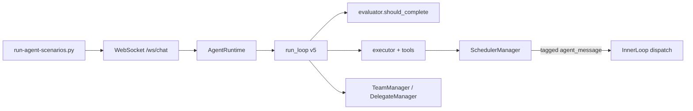

# Agent scenario harness

End-to-end validation of the Babo agent runtime against **45 scripted scenarios** spanning personal assistant, dev, orchestration, research, browser, automation, recipes, memory, extensibility, and data workflows.

This harness is the product’s **architecture acceptance gate**: it exercises the real WebSocket + agentic loop stack (not mocked tools), scores pass/fail heuristics, and writes JSON/Markdown reports under the desktop data directory.

---

## Status (May 2026)

| Metric | Value |
|--------|--------|
| **Latest run** | `run-20260529-190017` |
| **Pass rate** | **44 / 45** (98%) |
| **Model** | `google/gemini-2.5-flash` |
| **Runtime** | Local Babo desktop sidecar (`http://127.0.0.1:9222`) |
| **Parallelism** | 3 agents |
| **Duration** | ~27 minutes |

### What this proves

The harness validates the **full coordinator architecture**, not a single happy path:

- **Orchestrator modes** — plan → team → monitoring → evaluate (`orch-01`, `orch-07`, `dev-mini-plan`)
- **Verify gate before complete** — `plan(verify)` blocks premature `plan(complete)` (`orch-05`)
- **Delegate / team waves** — sub-agent research via `team` + background delegates (`dev-07`)
- **Profile-aware completion** — conversational PA without spurious `plan`/`team`; solo dev tool+prose exit
- **Scheduler isolation** — per-agent routing tags; no cross-agent `SCHEDULER_OK` preemption
- **Research & browser** — `web_search`, `web_fetch`, `browser`, artifact file checks
- **Automation** — `scheduler`, `poller`, idle-eligible `todo`
- **Memory & extensibility** — `wm`, `file_history`, `clawhub`, `skill_configure`, `discover_tools`
- **Data pipelines** — CSV, SQLite, archives, `offer_download`

One known flaky scenario remains: **`web-fetch-smoke`** — the model occasionally describes `web_fetch(...)` in chat without entering the agentic loop. This is model routing flake, not an architecture regression.

---

## Running the harness

**Prerequisites:** Babo desktop (or local runtime) listening on loopback port 9222.

```bash
# Dry-run (list scenarios only)
python scripts/run-agent-scenarios.py --dry-run

# Smoke subset
python scripts/run-agent-scenarios.py --tags smoke

# Full tier run (recommended for release checks)
python scripts/run-agent-scenarios.py \
  --parallel 3 \
  --exclude-tags smoke \
  --model google/gemini-2.5-flash \
  --keep-agents \
  -v
```

### Common flags

| Flag | Purpose |
|------|---------|
| `--parallel N` | Run N scenarios concurrently (default 1) |
| `--model` | Override inference model for all agents |
| `--tags` / `--exclude-tags` | Filter by YAML tags (`tier1`, `dev`, `orchestration`, …) |
| `--only` | Run a single scenario id (e.g. `dev-02`) |
| `--keep-agents` | Retain agent dirs under `%APPDATA%/babo-desktop/data/agents/` for forensics |

### Reports

Written to:

```text
%APPDATA%/babo-desktop/scenario-runs/run-YYYYMMDD-HHMMSS.{json,md}
```

Each result includes: pass/fail reasons, tools used, exit reason, duration, and optional agentic log forensics.

---

## Scenario layout

```text
scripts/
  run-agent-scenarios.py    # Harness runner
  scenarios/
    tier1-dev.yaml            # Dev + delegate scenarios
    tier2-research.yaml       # Research reports
    tier5-automation.yaml     # Scheduler / poller
    tier6-orchestration.yaml  # Plan / team / verify gate
    tier8-extensibility.yaml  # ClawHub, skill_configure
    tier9-data.yaml           # CSV, SQLite, archives
    tier11-recipes.yaml       # Recipe-style flows
    …
```

Each scenario defines:

- `prompt` — user message sent over WebSocket
- `timeout_s` — max wait for completion
- `pass` — scoring rules (`tools_any`, `min_response_chars`, `artifact_files`, …)
- `harness_follow_up` — optional second turn when chat-mode stalls (recipes)

Scenarios no longer force a conflicting identity rename (`Your name is ScenarioBot`); agents keep the API-assigned name `scenario-{id}`.

---

## Unit tests (harness helpers)

```bash
python -m pytest tests/test_harness_scoring.py \
  tests/test_scheduler_routing.py \
  tests/test_plan_verify_empty_init.py \
  tests/test_bash_git_guard.py \
  tests/test_profile_guard_policy.py \
  tests/test_orchestration_profile_spec.py -q
```

These cover:

- Spurious scheduler `agentic_complete` filtering during harness waits
- Per-agent scheduler message routing (`[AGENT_MSG|agent_id=…]`)
- Plan verify skipping empty package `__init__.py`
- Bash `git init` guard with `cd subfolder &&`
- Profile guard policy and orchestration profile spec

---

## Architecture components under test



Key runtime fixes validated by the 44/45 run:

| Fix | Module |
|-----|--------|
| Scheduler routes to owning agent only | `server/main.py`, `scheduler.py` |
| Skip empty `__init__.py` in plan verify | `plan.py` |
| Implicit tool+prose completion for solo profiles | `evaluator.py` |
| `team` accepted for delegate research scenario | harness YAML |
| Artifact file satisfies `write` requirement | `run-agent-scenarios.py` |

---

## Related

- [Agentic loop](../architecture/agentic-loop.md)
- [Orchestration & delegation](../architecture/orchestration-and-delegation.md)
- [2026 release notes](../architecture/2026-cloud-orchestration-release.md)
- [Local development](local-development.md)
