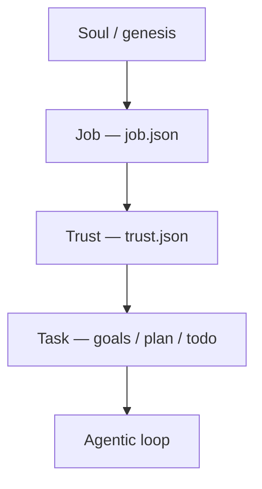
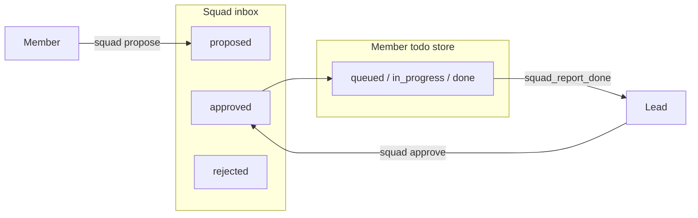

# Job, Trust & Squads

Babo separates **who an agent is at work** (Job), **what they may do** (Trust), and **what someone asked for right now** (Task). For agents on public channels, Job and Trust stay stable and owner-controlled so casual users cannot reshape identity or permissions through chat.

**Squads** are a **dashboard fleet** feature: a persistent group of full agents with a **lead**, shared inbox, and cross-member todos. They are **not** the same as **Teams** in Projects (ephemeral sub-agents inside one parent loop).

**API surface:** Python FastAPI runtime only (`server/routes/job_trust.py`, `server/routes/squads.py`). The hosted cloud browser reaches these routes through the existing **`/api/rt` runtime proxy** — there are **no** dedicated NestJS routes for job, trust, or squads.

**Design history:** [Brainstorm: Job, Trust, Task & Squads](../brainstorm/job-trust-task-squads.md) · **API reference:** [Job, Trust & Squad API](../reference/job-trust-squad-api.md)

---

## Job vs Trust vs Task

| Layer | Owner? | Lifetime | Purpose |
|-------|--------|----------|---------|
| **Job** | Yes (UI / REST) | Until owner PATCH | Employment charter: title, mission, persona, scope, refusal voice |
| **Trust** | Yes | Until owner PATCH | Tool allow/deny, action classes, per-channel caps |
| **Task** | No (turn/plan) | Ephemeral | Current user message, plan step, channel dispatch |

**Rule:** Tasks must not override Job. A hostile channel message may produce tactical goals; Trust blocks tool execution; Job supplies the refusal wording.

---

## Job (employment charter)

### What it controls

- **Title** — shown on the agent dashboard card (default: *General helpful assistant*).
- **Mission, persona, playbook** — injected into Cryptex identity and instruction rings.
- **In scope / out of scope** — boundary lists for reasoning and public-channel evaluation.
- **Refusal template** — short reply pattern for out-of-scope or policy-blocked requests.
- **Default orchestration profile** — e.g. `conversational`, `solo_structured`, `orchestrated`, `squad_lead`.

### Persistence

`data/agents/{runtimeAgentId}/job.json`

On load and after owner PATCH, `AgentRuntime.sync_job_trust()` copies Job (and Trust) into Cryptex **`ACCESS_SYSTEM`** slots so **task-epoch hygiene** does not clear them.

### Editing in the UI

On the **Dashboard** → **Squads** panel (or agent cards in squads):

- **Job** — opens the charter modal **Job** tab.
- **Trust** — opens the **Trust** tab.

Each tab has its own **Save** button (job and trust are patched independently).

### Cryptex domains (summary)

| Job content | Typical Cryptex domain |
|-------------|------------------------|
| Title, mission | `Job.Title`, `Job.Mission` |
| Persona | `Job.Persona` |
| Playbook | `Job.Playbook.*` |
| Boundaries | `RING_BEHAVIORAL` via trust sync |
| Strategic priorities | `Goal.Strategic.Job.*` |

---

## Trust (action rails)

### Global tool policy

- **`tools_allow`** — if non-empty, only listed tools are permitted (except explicit denies).
- **`tools_deny`** — hard deny before execution (logged).
- **`action_classes_allow` / `action_classes_deny`** — reserved for action-class matrices (v1 primarily uses tool lists).

Enforcement runs in the agentic **executor** via `is_tool_denied_by_trust()`.

### Channel overlays

Per **`channel_key`** (matched against `dispatch_source`, e.g. `user:channel:discord-general`):

| Field | Effect |
|-------|--------|
| `profile_cap` | Ceiling orchestration profile (e.g. `conversational` on public Discord) |
| `tools_allow` / `tools_deny` | Extra allow/deny on that channel |
| `public_channel` | Stricter out-of-scope evaluation using Job refusal template |

**Public channel guard:** before the loop runs tools, `evaluate_public_channel_request()` may force a **conversational** profile and refusal goals when the message matches `out_of_scope` patterns on a public overlay.

### Editing overlays

Trust tab → **Channel overlays** → add channel key, profile cap, tools allow/deny, **Public channel** checkbox.

---

## Squads (persistent fleet)

### Squad vs Team

| | **Team** (Projects) | **Squad** (Dashboard) |
|--|---------------------|------------------------|
| Lifetime | Ephemeral wave in one agent’s loop | Persistent until deleted |
| Members | Sub-agent delegates | Full agents (separate runtimes, memory, Job) |
| UI | `/projects/:agentId` board & timeline | Dashboard **Squads** panel |
| Coordination | `team` tool, `TeamManager` | `squad` tool, `SquadManager` |

Squad membership **adds** coordination tools; it does **not** remove `plan`, `team`, `delegate`, or other tools. Job and Trust still gate each member.

### Creating a squad

**Dashboard** → **Squads** → **Create squad**:

1. Name the squad.
2. Pick a **lead** agent.
3. Select **members** (lead is always included).

Persistence: `data/squads/{squad_id}.json` plus `data/squads/index.json` (agent → squad mapping). **One squad per agent** (enforced by registry).

### Visibility

| Caller | List squads | Squad detail / Kanban | Mutate settings / delete |
|--------|-------------|----------------------|---------------------------|
| No `caller_agent_id` | All squads (admin-style) | Member check if caller provided | Lead required when caller set |
| Squad member | Only their squads | Yes | — |
| Squad lead | Yes | Yes | Checkback settings, delete squad |

Pass identity as query **`caller_agent_id`** or header **`X-Babo-Agent-Id`**. The dashboard uses the squad **lead** id for lead-only operations.

### Two-tier work: inbox → approve → member todo

1. **Propose** — any member (or lead) adds an inbox item (`proposed`).
2. **Approve / reject** — lead only; approve creates a **todo-list** item on the assignee with `squad_id`, `squad_inbox_id`, `idle_eligible`.
3. **Assign / reassign** — lead can assign directly or move work between members.
4. **Done** — member uses `squad_report_done`; lead may get `squad_item_done:{squad_id}` dispatch.

Inbox and escalations live on the squad JSON record; member todos stay in each agent’s todo-list store (no shared file — avoids cross-process write races).

### Squad tools (runtime)

Registered on agents that belong to a squad (`AgentRuntime.sync_squad_tools()`):

| Tool | Typical caller | Purpose |
|------|----------------|---------|
| `squad` | Lead (full); members (read/propose) | `inspect`, `list_inbox`, `propose`, `approve`, `reject`, `assign`, `reassign`, `resolve_escalation`, `brief`, `checkback`, `pause`, `resume`, `status` |
| `squad_escalate` | Members | Wake lead with open escalation |
| `squad_message` | Any member | Internal peer message (optional wake) |
| `squad_report_done` | Members | Complete approved squad todo → notify lead |

### `squad_lead` orchestration profile

Fourth depth alongside `conversational`, `solo_structured`, and `orchestrated`:

- **Default** for `squad.lead_agent_id` (also settable via Job `default_profile`).
- **Forced** on squad orchestration dispatches: `squad_checkback:*`, `squad_escalation:*`, `squad_item_done:*`.
- Extends orchestrated behavior with squad behavioral domains and stricter completion on squad wakes (must resolve inbox/escalations, not stop at prose).

Members use normal triage profiles unless channel Trust caps them.

### Lead checkback (scheduler)

`SquadCheckbackScheduler` ticks every 60s and may wake the lead when:

- Checkback **interval** elapsed (default 30 minutes, minimum 5 minutes between any wakes), or
- **Pending inbox proposals** exist, or
- **Proposal SLA** exceeded (default 4 hours), or
- **Open escalations** exist.

Configure per squad: **Dashboard** → squad card → **Checkback** (enable, interval minutes, proposal SLA hours).

Duplicate wakes are suppressed if the lead already has a pending `squad_*:{squad_id}` dispatch.

### Aggregated squad board (UI)

**Board** on a squad card opens a modal:

- Inbox columns (proposed / approved)
- Open escalations
- Per-member squad-scoped todos

Backed by `GET /api/squads/{squad_id}/kanban?caller_agent_id=...`.

### Owner channel pattern

Typical fleet layout:

| Channel | Agent |
|---------|--------|
| Public Discord `#general` | Community moderator |
| `#bugs` | QA agent |
| Staff / audit | Channel admin (often **squad lead**) |
| Owner WhatsApp / Telegram | **Lead only** |

The lead coordinates via squad tools; members escalate to the lead, not the owner’s private channel unless Trust allows.

---

## Example: three-agent Discord fleet

See the role matrix in the [brainstorm doc](../brainstorm/job-trust-task-squads.md#reference-roles-discord--telegram-fleet). In production:

1. Create three agents with distinct **Job** charters (admin, moderator, QA).
2. Tighten **Trust** per channel (public caps on `#general`).
3. **Create squad** with admin as lead, mod + QA as members.
4. Bind channels to the right agents in **Tools / integrations**.
5. Enable **checkback** on the squad so the lead periodically reviews inbox and member health.

---

## Cloud browser vs desktop

| Client | Job / Trust / Squad API |
|--------|-------------------------|
| **Electron desktop** | `ApiService` → `runtimeUrl` (e.g. `http://127.0.0.1:9222`) |
| **Hosted web** | `ApiService` → `/api/rt` proxy to the user’s paired Python runtime |

NestJS continues to handle auth, agent metadata, and channel relay. Job, trust, and squad documents live on the **runtime data disk** next to agent memory.

---

## Code map

| Area | Path |
|------|------|
| Job / Trust models & Cryptex sync | `nls/runtime/job_trust.py` |
| Profile resolution (squad lead) | `nls/runtime/agent_profile.py` |
| Public channel guard | `nls/runtime/public_channel_guard.py` |
| Squad registry / manager | `nls/agentic/squad_registry.py`, `squad_manager.py` |
| Checkback scheduler | `nls/agentic/squad_checkback_scheduler.py` |
| Squad tools | `nls/tools/agent_tools/squad.py` |
| Profile spec | `nls/agentic/orchestration_profile_spec.py` (`squad_lead`) |
| Depth nudges | `nls/agentic/profile_depth_policy.py` |
| REST | `server/routes/job_trust.py`, `squads.py`, `squad_access.py` |
| UI | `frontend/.../squads-panel/`, `agent-charter-modal/` |

---

## Related

- [Projects & teams](projects-and-teams.md) — ephemeral Teams and Kanban (single agent)
- [Agentic loop & plans](agentic-loop-and-plans.md)
- [Orchestration & delegation](../architecture/orchestration-and-delegation.md)
- [Memory](memory.md) — Cryptex rings and ACCESS_SYSTEM
- [Data directory](../reference/data-directory.md)
- [Integrations](integrations/index.md) — channel binding
