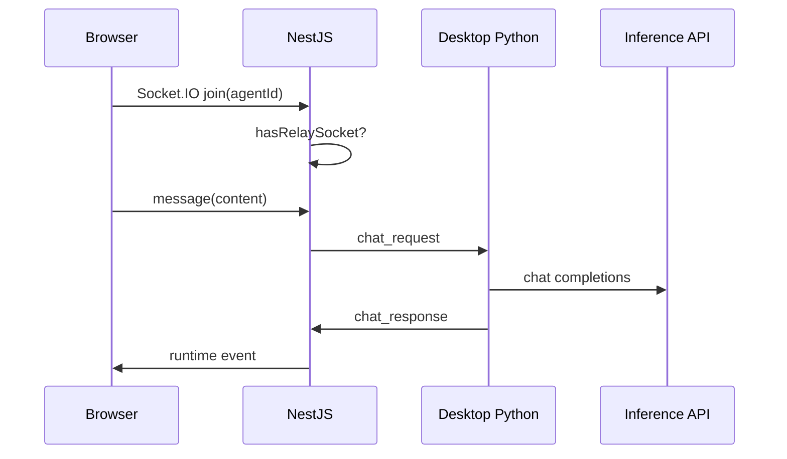

# Relay protocol

The **relay** connects a **desktop Python runtime** (behind NAT) to a **hosted NestJS backend**. The desktop opens an **outbound** WebSocket; NestJS pushes inbound traffic and proxies HTTP.

**Implementation:**

- NestJS: `backend/src/main.ts` (upgrade handler), `backend/src/channels/channels.service.ts`
- Python: `nls/runtime/channels.py` (`ChannelRelayClient`)

---

## Connection

```text
wss://<nestjs-host>/api/channels/relay/{runtimeAgentId}?secret=<RUNTIME_SHARED_SECRET>
```

| Parameter | Required | Notes |
|-----------|----------|-------|
| `runtimeAgentId` | Yes | Python agent id (not always DB UUID) |
| `secret` | If `RUNTIME_SHARED_SECRET` set on NestJS | Must match `NLS_SHARED_SECRET` on desktop |

On connect, NestJS sends:

```json
{ "type": "connected", "agentId": "<runtimeAgentId>" }
```

Python should respond with:

```json
{
  "type": "agent_info",
  "agent_id": "<runtimeAgentId>",
  "name": "My Agent",
  "genesis_version": "standard-v1"
}
```

NestJS may auto-create a Postgres `Agent` row from `agent_info`.

---

## NestJS → desktop (outbound on relay socket)

| `type` | Purpose | Key fields |
|--------|---------|------------|
| `connected` | Handshake ack | `agentId` |
| `channel_message` | Webhook payload for a channel skill | `channel`, `payload` |
| `chat_request` | Remote web chat message | `content`, `session_key`, `request_id`, `channel_type` |
| `http_proxy` | Proxy REST call to local runtime | `request_id`, `method`, `path`, `body` |
| `skill_install` | Push ClawHub/skill files to desktop | `slug`, `files` (path → content) |

### `chat_request` flow

1. Browser sends Socket.IO `message` on `/chat` while `relayMode=true`
2. NestJS `pushChatToRelay(runtimeAgentId, content, sessionKey, requestId)`
3. Desktop handles via `ChannelRelayClient._handle_chat_request` → local HTTP `/chat/relay` or in-process handler
4. Desktop replies with `chat_response`

### `http_proxy` flow

1. Browser calls `GET/POST /api/rt/...` (JWT)
2. `RuntimeProxyController` → `proxyHttpViaRelay(agentId, method, path, body)`
3. Desktop executes against `127.0.0.1:NLS_PORT`
4. Desktop replies with `http_proxy_response`

Default timeout: **30 seconds** (configurable in `ChannelsService.proxyHttpViaRelay`).

---

## Desktop → NestJS (inbound on relay socket)

| `type` | Purpose | Key fields |
|--------|---------|------------|
| `agent_info` | Register metadata | `agent_id`, `name`, `genesis_version` |
| `chat_response` | Answer to `chat_request` | `request_id`, `content`, `error?`, `nls?` |
| `http_proxy_response` | Answer to `http_proxy` | `request_id`, `body`, `error?` |
| `broadcast` | Runtime events for remote UIs | `event` (same shape as WS chat events) |

### `broadcast` events

Forwarded to all Socket.IO clients subscribed to that agent (`broadcastListeners`). Supports batched wrapper:

```json
{
  "type": "broadcast",
  "event": {
    "type": "batch_update",
    "events": [ { "type": "thought", "..." }, ... ]
  }
}
```

Examples of inner `event.type`: `thought`, `tool_start`, `tool_end`, `response_chunk`, `sleep_start`, `signal`, `status`, etc. (mirror Python `ConnectionManager` broadcasts).

---

## Channel webhooks without relay

`POST /api/channels/webhook/:channel/:agentId` (no JWT):

1. Verify provider signature when applicable (Slack signing secret)
2. Try `pushToRelayByAgentId` immediately
3. Else queue in `PendingChannelMessage` for drain on reconnect (`drainAndPushPending`)

**Discord** does not use this webhook path for messages — see `DiscordGatewayService` and `POST /api/channels/discord/register/:agentId`. Relay still delivers `channel_message` with `"channel": "discord"`.

---

## Sequence: remote web chat



---

## Related

- [Deployment topologies](../architecture/deployment-topologies.md)
- [Channels & webhooks](../architecture/channels-and-webhooks.md)
- [WebSocket events](websocket-events.md)
